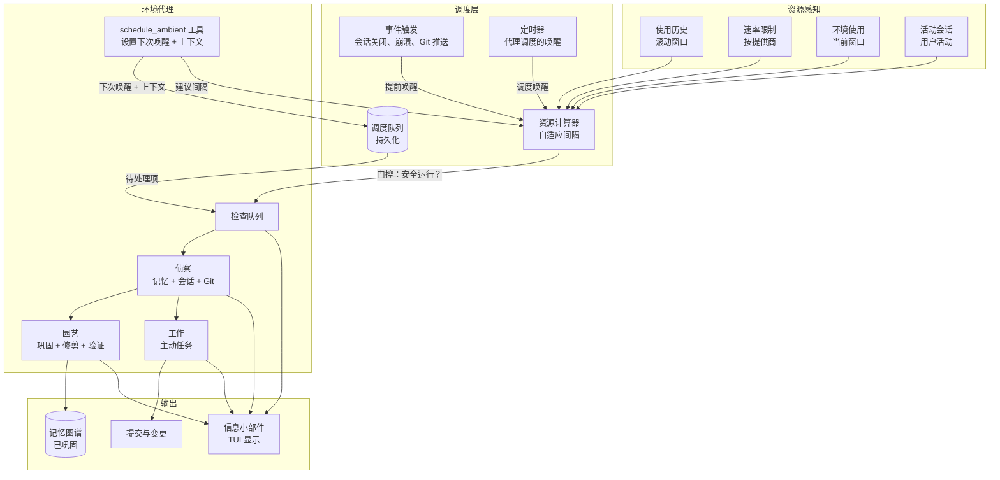
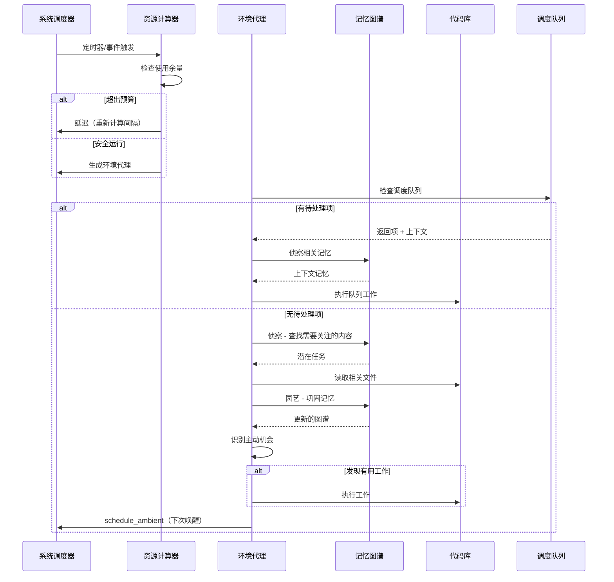

# 环境模式（Ambient Mode）

> **状态：** 设计阶段  
> **更新日期：** 2026-02-08

一种主动的、始终在线的代理模式，无需用户提示即可自主工作。就像大脑在睡眠中巩固记忆一样，环境模式负责维护记忆图谱、识别有用的工作，并代表用户采取行动——同时保持在资源限制范围内。

## 概述

环境模式作为一个后台循环运行，执行以下操作：

1. **园艺（Gardens）** — 巩固、修剪和强化记忆图谱
2. **侦察（Scouts）** — 分析最近的会话、Git 历史记录和记忆，以了解用户关心什么
3. **工作（Works）** — 主动完成用户会乐于被惊喜的任务

这些并非独立的阶段。代理在一次传递中同时完成所有三项工作——在查看记忆时，它自然会发现维护工作，并同时识别主动机会。

**关键设计决策：**

1. **每次仅一个代理** — 任何时候只运行一个环境实例，无并行
2. **订阅优先** — 默认使用 OAuth（OpenAI/Anthropic），除非显式配置，否则绝不使用 API 密钥
3. **用户优先** — 交互式会话始终优先于环境工作
4. **强模型** — 使用所选提供商中最强的可用模型，以便代理能够很好地推理什么真正有用
5. **自我调度** — 代理决定下次何时唤醒，受自适应资源限制约束

## 架构



## 环境循环

每个环境周期遵循单一流程。代理不会在“模式”之间切换——它会在一次传递中自然地处理园艺、侦察和工作。



## 调度与资源限制

环境模式使用自适应调度，基于：

- **使用历史** — 滚动窗口跟踪 API 使用情况
- **提供商速率限制** — 每个提供商有自己的限制
- **当前环境使用** — 跟踪此窗口内已使用的量
- **活动会话** — 用户会话优先

资源计算器在生成环境代理之前检查是否有足够的“余量”。如果超出预算，它会延迟并重新计算间隔。

代理通过 `schedule_ambient` 工具设置自己的下次唤醒时间，建议的间隔受资源计算器约束。

## 用户界面集成

环境模式通过信息小部件（Info Widgets）在 TUI 中显示其状态：

- 当前环境状态（空闲、侦察、工作、园艺）
- 上次环境周期的结果
- 待处理的调度项
- 资源使用情况

## 配置

环境模式可通过 `~/.jcode/config.toml` 进行配置：

```toml
[ambient]
enabled = true
max_cycles_per_day = 12
max_tokens_per_cycle = 100000
model = "gpt-5.3-codex-spark"  # 可选，覆盖默认
```

## 未来工作

- **多代理环境** — 当前限制为单代理；未来可能支持并行环境代理
- **更丰富的调度** — 基于用户活动模式的学习调度
- **环境工作审批** — 在重大操作前请求用户确认