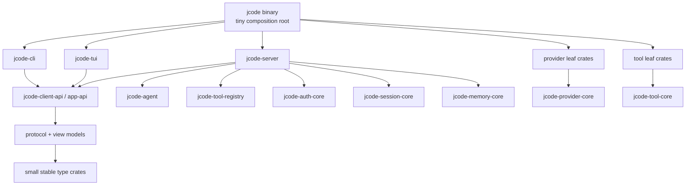

# 编译时隔离重构

这是使完整功能调试/自我开发（selfdev）构建更快，同时不减少开发者二进制文件中功能的活跃迁移计划。

## 目标

保持正常的调试/自我开发二进制文件类似于生产环境，包括 PDF、嵌入、提供商、更新/自我开发工具和其他集成，同时减少常见编辑后必须重新编译的 Rust 代码量。

目标不仅仅是“更多 crate”。目标是具有更小串行前端单元和更清晰失效边界的更宽依赖 DAG（有向无环图）。

## 当前诊断

工作区已经有许多 crate，但关键路径由少量大型 crate 线性堆叠主导：


从最后可用的 Cargo 计时报告（用 `scripts/compile_time_probe.sh --skip-build` 解析）：
- Cargo 计时墙钟：**16.00s**
- 已知 jcode 串行栈跨度：**14.72s**
- 已知 jcode 串行栈求和单元时间：**17.36s**
- 已知 jcode 串行栈前端时间：**11.99s**

该计时报告中速度最慢的单元：

| 单元 | 总计 | 前端 | 代码生成 |
|---|---|---|---|
| `jcode-app-core` | 4.73s | 3.82s | 0.91s |
| `jcode-base` | 4.34s | 3.63s | 0.71s |
| `jcode-tui` | 4.18s | 3.14s | 1.04s |
| `jcode` bin | 2.34s | n/a | n/a |
| `jcode` lib | 1.77s | 1.40s | 0.37s |

这意味着主要瓶颈是几个巨型 crate 中的 rustc 前端序列化，而不是链接器选择或第三方冷编译。

## 测量

对每个阶段使用聚焦计时探针：

```bash
scripts/compile_time_probe.sh --json target/compile-time-probe.json
scripts/compile_time_probe.sh --touch crates/jcode-tui/src/tui/app/input.rs
scripts/compile_time_probe.sh --touch crates/jcode-app-core/src/server.rs
scripts/compile_time_probe.sh --touch crates/jcode-base/src/provider/mod.rs
```

对于更广泛的重测，继续使用：

```bash
scripts/bench_compile.sh selfdev-jcode --runs 3 --touch <file> --json
scripts/bench_selfdev_checkpoints.sh --skip-cold --touch <file> --runs 1
```

至少跟踪：
1. 完整功能自我开发构建墙钟时间。
2. Cargo 计时墙钟时间。
3. `jcode-base -> jcode-app-core -> jcode-tui -> jcode lib -> jcode bin` 栈跨度。
4. 串行栈中前端时间之和。
5. 触及代表性高变动文件后的增量重建。
6. 来自 `scripts/compile_isolation_report.py` 的静态报告漂移：LOC、内联测试、`async_trait` 和目标状态依赖警告。

## 目标架构



规则：
- TUI 和 CLI 依赖于 client API、protocol、view models 和小型 type crate，而非完整的 server/provider/tool 实现。
- Provider 实现是叶子 crate。AWS/Bedrock 依赖仅存在于 Bedrock provider crate 中。
- Tool 实现是叶子 crate。PDF/browser/Gmail/search 等重型工具被隔离在 tool-core 接口之后。
- 共享的底层 crate 小而稳定。避免将高变动行为放入 protocol/type crate。
- 在最终架构中避免宽泛的 `pub use whole_crate::*` 兼容梯子。

## 迁移顺序

### 阶段 0：测量与护栏

状态：已开始。

交付物：
- `scripts/compile_time_probe.sh`
- `scripts/compile_isolation_report.py`
- 本文档
- 依赖边界检查/警告报告

成功标准：
- 每个结构阶段都有前后计时。
- 计时报告使串行栈可见。

### 阶段 1：拓宽巨型 crate 关键路径

将三个长尾 crate 拆分为兄弟领域 crate。优先级是拓宽图，而不是提取更多微型 type crate。

可能的首次拆分：

**从 `jcode-base` 中拆分：**
- `jcode-auth-core`
- `jcode-session-core`
- `jcode-memory-core`
- provider 实现 crate，特别是 Bedrock/AWS 作为叶子

**从 `jcode-app-core` 中拆分：**
- `jcode-server`
- `jcode-agent`
- `jcode-tool-registry`
- 按需为 background/swarm/update/selfdev 拆分 service crate

**从 `jcode-tui` 中拆分：**
- 首先拆分 `jcode-client-api` / view-model 边界
- 然后仅在创建真正并行单元时，将可重用的客户端状态逻辑移出终端渲染 crate

成功标准：
- 触及常见 TUI 代码不再重新编译 app-core/provider/server 实现 crate。
- 触及 provider 实现不再重新编译 TUI 或宽泛的 base 代码。
- Cargo 计时显示多个中等规模的 Jcode crate 并行运行，而非一个 4 层深度的巨型 crate 梯子。

### 阶段 2：移除 glob 再导出梯子

当前的兼容层保留了旧的单体形状：

```rust
pub use jcode_base::*;
pub use jcode_app_core::*;
pub use jcode_tui::*;
```

迁移方法：
1. 在移动代码期间暂时保留兼容再导出。
2. 将高变动模块转换为从叶子 crate 显式导入。
3. 一旦下游导入变为显式，移除 glob 再导出。

成功标准：
- 新代码不依赖全层 prelude 风格的再导出。
- 依赖方向在导入和 Cargo manifest 中可见。

### 阶段 3：将内联测试移出热点 crate

问题：
- 内联 `#[cfg(test)]` 模块使 `cargo test` 将大型生产 crate 和大型测试体编译为一个 rustc 单元。

目标：
- 针对广泛行为测试使用集成测试或专用的 `*-test-support` crate。
- 仅当单元测试真正本地化且轻量时，才保留内联。

成功标准：
- 针对性测试不再需要为无关领域进行单体 test cfg 构建。

### 阶段 4：减少前端宏开销

目标：
- 在 trait 不作为 `dyn` 使用时，将 `async_trait` 替换为原生 `async fn in traits`。
- 仅在对象安全的插件/接口边界处保留 `async_trait`，其中 boxed future 是有意为之。
- 除非类型稳定且必要，否则避免向宽泛的共享 crate 添加 derive-heavy 类型。

成功标准：
- 热点 crate 中的过程宏展开更少。
- 无对象安全回归。

## 反目标

- 不要使快速调试构建默认不完整。
- 不要将代码拆分为微型 crate，除非拆分创建了真正的失效或并行边界。
- 不要将高变动行为移入底层 type/protocol crate。
- 不要进行单一的巨大重写。每个阶段都应可构建且可测量。

## 每个阶段的验证检查清单

在提交一个阶段之前：

```bash
scripts/compile_time_probe.sh --skip-build
scripts/compile_isolation_report.py
scripts/check_dependency_boundaries.py
cargo check --profile selfdev -p jcode --bin jcode
```

对于代码移动阶段，还需运行被移动领域的相关针对性测试，并在实际可行时通过协同自我开发路径进行一次完整的自我开发构建：

```bash
selfdev build target=tui
```