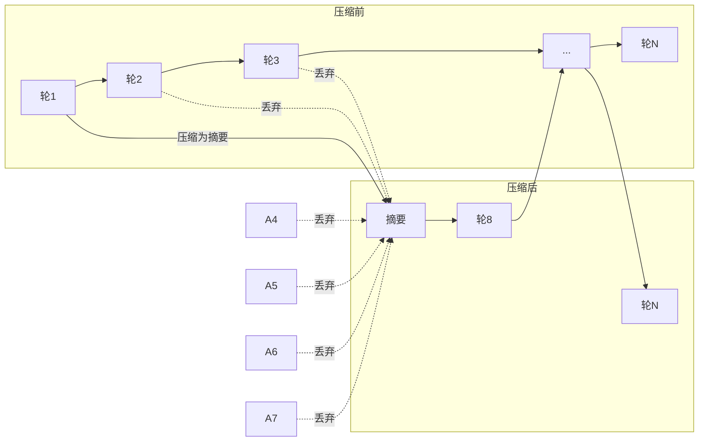

- [Jcode 使用指南](#jcode-使用指南)
  - [概述](#概述)
  - [安装](#安装)
    - [快速安装](#快速安装)
    - [macOS 通过 Homebrew](#macos-通过-homebrew)
    - [源码编译](#源码编译)
    - [Termux (Android)](#termux-android)
    - [卸载](#卸载)
    - [平台支持](#平台支持)
  - [架构](#架构)
  - [快速开始](#快速开始)
  - [命令行命令](#命令行命令)
    - [全局选项](#全局选项)
    - [子命令](#子命令)
  - [JSON 输出与脚本集成](#json-输出与脚本集成)
  - [提供商与模型配置](#提供商与模型配置)
    - [支持的登录方式](#支持的登录方式)
    - [OpenAI 兼容提供商配置](#openai-兼容提供商配置)
    - [自定义 API 端点](#自定义-api-端点)
    - [本地运行环境](#本地运行环境)
    - [配置示例 (`~/.jcode/config.toml`)](#配置示例-jcodeconfigtoml)
      - [1. TOML 主配置 — DeepSeek 与本地配置实例](#1-toml-主配置--deepseek-与本地配置实例)
      - [2. JSON 环境变量（JSON Env）](#2-json-环境变量json-env)
      - [3. ENV 文件凭据](#3-env-文件凭据)
      - [4. 环境变量运行时覆盖](#4-环境变量运行时覆盖)
  - [配置文件格式](#配置文件格式)
    - [支持的格式总览](#支持的格式总览)
    - [主配置（TOML）](#主配置toml)
      - [`[display]` — 显示与界面](#display--显示与界面)
      - [`[display.native_scrollbars]` — 原生滚动条](#displaynative_scrollbars--原生滚动条)
      - [`[keybindings]` — 快捷键绑定](#keybindings--快捷键绑定)
      - [`[dictation]` — 语音听写](#dictation--语音听写)
      - [`[features]` — 功能开关](#features--功能开关)
      - [`[provider]` — 提供商全局设置](#provider--提供商全局设置)
      - [`[agents]` — Agent 设置](#agents--agent-设置)
      - [`[websearch]` — 网络搜索](#websearch--网络搜索)
      - [`[tools]` — 工具配置](#tools--工具配置)
      - [`[ambient]` — 后台环境模式](#ambient--后台环境模式)
      - [`[safety]` — 安全系统通知](#safety--安全系统通知)
      - [`[notifications]` — 通知设置](#notifications--通知设置)
      - [`[compaction]` — 上下文压缩](#compaction--上下文压缩)
      - [`[hooks]` — 钩子](#hooks--钩子)
      - [`[power]` — 电源管理](#power--电源管理)
      - [`[gateway]` — HTTP 网关](#gateway--http-网关)
      - [`[sponsors]` — 赞助商](#sponsors--赞助商)
      - [`[launch_hotkeys]` — 启动热键](#launch_hotkeys--启动热键)
      - [`[acp]` — ACP（Agent Communication Protocol）](#acp--acpagent-communication-protocol)
      - [`[auth]` — 认证](#auth--认证)
      - [`[autoreview]` / `[autojudge]` — 自动审查/评判](#autoreview--autojudge--自动审查评判)
    - [凭据存储（ENV 文件）](#凭据存储env-文件)
    - [其他配置文件（JSON）](#其他配置文件json)
    - [运行时环境变量覆盖](#运行时环境变量覆盖)
  - [数据目录结构](#数据目录结构)
  - [内部命令（TUI 中可使用）](#内部命令tui-中可使用)
    - [会话管理](#会话管理)
    - [显示与界面](#显示与界面)
    - [模型与提供商](#模型与提供商)
    - [上下文与修复](#上下文与修复)
    - [服务器与管理](#服务器与管理)
    - [Agent 与协作](#agent-与协作)
    - [目标与任务](#目标与任务)
    - [Git 与发布](#git-与发布)
    - [工具与快捷键](#工具与快捷键)
    - [其他](#其他)
  - [典型的高效工作流](#典型的高效工作流)
  - [多终端使用（最佳实践）](#多终端使用最佳实践)
    - [典型工作流](#典型工作流)
    - [各终端独立工作](#各终端独立工作)
    - [记忆共享](#记忆共享)
    - [上下文 vs 记忆：对指令理解的影响](#上下文-vs-记忆对指令理解的影响)
    - [推荐策略：一个项目一个主会话](#推荐策略一个项目一个主会话)
    - [信息回流主会话的 6 种方法](#信息回流主会话的-6-种方法)
      - [方法 1：`/save` + `--resume` 手动切回（最简单）](#方法-1save----resume-手动切回最简单)
      - [方法 2：`memory remember` 记录关键信息（自动跨会话共享）](#方法-2memory-remember-记录关键信息自动跨会话共享)
      - [方法 3：复制关键输出到主会话（适合传递详细方案）](#方法-3复制关键输出到主会话适合传递详细方案)
      - [方法 4：临时文件总结（适合大型变更）](#方法-4临时文件总结适合大型变更)
      - [方法 5：从会话转录文件中提炼信息（无需手动总结）](#方法-5从会话转录文件中提炼信息无需手动总结)
      - [方法选择对照表](#方法选择对照表)
      - [方法 6：`memory export` / `import` 记忆批量导出导入（适合知识迁移与备份）](#方法-6memory-export--import-记忆批量导出导入适合知识迁移与备份)
      - [完整流程示例](#完整流程示例)
    - [跨终端协作](#跨终端协作)
    - [注意事项](#注意事项)
  - [推理与思考（Reasoning / Chain of Thought）](#推理与思考reasoning--chain-of-thought)
    - [配置文件](#配置文件)
    - [内部命令](#内部命令)
    - [快捷键](#快捷键)
    - [提供者层面配置](#提供者层面配置)
    - [模型默认推理力度](#模型默认推理力度)
    - [可视化表现](#可视化表现)
    - [思维链（CoT）vs 思维树（ToT）](#思维链cotvs-思维树tot)
    - [ReAct 框架（Reasoning + Acting）](#react-框架reasoning--acting)
  - [检索增强生成（RAG）](#检索增强生成rag)
    - [外部知识库集成](#外部知识库集成)
      - [支持的外部知识库类型](#支持的外部知识库类型)
      - [方法一：MCP 知识库服务器（推荐）](#方法一mcp-知识库服务器推荐)
      - [方法二：使用 `webfetch` + `websearch` 作为临时知识源](#方法二使用-webfetch--websearch-作为临时知识源)
      - [方法三：自定义 MCP 知识库服务器（最灵活）](#方法三自定义-mcp-知识库服务器最灵活)
      - [MCP 知识库的生命周期](#mcp-知识库的生命周期)
      - [使用方式](#使用方式)
    - [RAG 架构总览](#rag-架构总览)
    - [自动 RAG（核心功能）](#自动-rag核心功能)
    - [手动 RAG 检索](#手动-rag-检索)
    - [知识库构建](#知识库构建)
    - [Agent 如何利用 RAG](#agent-如何利用-rag)
    - [其他检索源](#其他检索源)
    - [配置选项](#配置选项)
  - [上下文管理](#上下文管理)
    - [方法一：自动上下文压缩（Compaction）](#方法一自动上下文压缩compaction)
      - [三种压缩模式](#三种压缩模式)
      - [紧急硬压缩（Hard Compaction）](#紧急硬压缩hard-compaction)
      - [关键参数](#关键参数)
      - [压缩摘要格式](#压缩摘要格式)
    - [方法二：手动压缩](#方法二手动压缩)
    - [方法三：会话管理（Save / Resume / Fork）](#方法三会话管理save--resume--fork)
      - [/save + --resume（保存与恢复）](#save----resume保存与恢复)
      - [/fork（分叉对话）](#fork分叉对话)
      - [上下文重置策略](#上下文重置策略)
    - [方法四：回滚与紧急修复](#方法四回滚与紧急修复)
    - [方法五：上下文注入（/btw）](#方法五上下文注入btw)
    - [方法六：上下文预算配置](#方法六上下文预算配置)
    - [方法七：多会话策略](#方法七多会话策略)
    - [方法总结决策表](#方法总结决策表)
  - [任务自动化：从"助手"到"执行者"](#任务自动化从助手到执行者)
    - [总体架构](#总体架构)
    - [机制一：Initiative（目标管理）— 自主规划的起点](#机制一initiative目标管理-自主规划的起点)
      - [创建目标](#创建目标)
      - [查看和管理目标](#查看和管理目标)
      - [Agent 驱动的目标循环](#agent-驱动的目标循环)
    - [机制二：Subagent（子代理）— 委派执行](#机制二subagent子代理-委派执行)
    - [机制三：Swarm（群体协作）— 复杂任务并行分解](#机制三swarm群体协作-复杂任务并行分解)
      - [Swarm 的自主规划能力](#swarm-的自主规划能力)
      - [启动 Swarm 的几种方式](#启动-swarm-的几种方式)
      - [任务图（Task Graph）](#任务图task-graph)
      - [自动生成任务图](#自动生成任务图)
      - [Swarm 的自主模式](#swarm-的自主模式)
    - [机制四：Ambient（后台自主运行）— 无需值守的自动化](#机制四ambient后台自主运行-无需值守的自动化)
      - [启用 Ambient](#启用-ambient)
      - [Ambient 的工作循环](#ambient-的工作循环)
      - [安全审批系统](#安全审批系统)
      - [定时任务](#定时任务)
    - [机制五：组合拳 — 完整的自主执行流水线](#机制五组合拳--完整的自主执行流水线)
      - [流水线步骤](#流水线步骤)
      - [完整示例](#完整示例)
    - [实战决策矩阵](#实战决策矩阵)
    - [配置建议](#配置建议)
  - [AI 任务路由：根据任务类型选择最优工具和协作模式](#ai-任务路由根据任务类型选择最优工具和协作模式)
    - [核心理念：不要用锤子切菜](#核心理念不要用锤子切菜)
    - [Jcode 内置的智能路由机制](#jcode-内置的智能路由机制)
      - [1. 模型级别路由（swarm-prompt.md）](#1-模型级别路由swarm-promptmd)
      - [2. Effort 级别路由（投入程度）](#2-effort-级别路由投入程度)
      - [3. 工具级别路由（选择正确的工具组合）](#3-工具级别路由选择正确的工具组合)
      - [4. 协作模式路由（单人/并行/后台）](#4-协作模式路由单人并行后台)
    - [10 倍效率工作流模板](#10-倍效率工作流模板)
      - [模板 1：Bug 修复工作流](#模板-1bug-修复工作流)
      - [模板 2：新功能开发工作流](#模板-2新功能开发工作流)
      - [模板 3：代码审查工作流](#模板-3代码审查工作流)
      - [模板 4：技术调研工作流](#模板-4技术调研工作流)
      - [模板 5：批量重构工作流](#模板-5批量重构工作流)
    - [任务路由实战决策表](#任务路由实战决策表)
    - [配置你的路由系统](#配置你的路由系统)
      - [自定义 swarm-prompt.md](#自定义-swarm-promptmd)
      - [Jcode 全局配置](#jcode-全局配置)
    - ["10 倍效率"的核心原则](#10-倍效率的核心原则)
    - [一句话总结](#一句话总结)
  - [记忆系统](#记忆系统)
    - [工作原理](#工作原理)
    - [记忆工具](#记忆工具)
    - [记忆 CLI 命令](#记忆-cli-命令)
    - [记忆存存储位置](#记忆存存储位置)
    - [环境依赖与模型下载](#环境依赖与模型下载)
  - [MCP 配置（JSON）](#mcp-配置json)
    - [MCP 是什么](#mcp-是什么)
    - [MCP 在 Jcode 中的作用](#mcp-在-jcode-中的作用)
    - [Jcode 推荐的 MCP 使用方式](#jcode-推荐的-mcp-使用方式)
    - [配置文件位置与优先级](#配置文件位置与优先级)
  - [Skills（技能系统）](#skills技能系统)
    - [核心概念](#核心概念)
    - [Skill 文件格式（SKILL.md）](#skill-文件格式skillmd)
    - [安装位置](#安装位置)
    - [使用方法](#使用方法)
      - [1. 通过斜杠命令调用（推荐）](#1-通过斜杠命令调用推荐)
      - [2. 通过 skill\_manage 工具（Agent 使用）](#2-通过-skill_manage-工具agent-使用)
    - [三个内置推荐 Skill](#三个内置推荐-skill)
    - [从外部导入](#从外部导入)
    - [更多 Skill](#更多-skill)
    - [注意事项](#注意事项-1)
  - [Swarm 群体协作](#swarm-群体协作)
    - [适用场景](#适用场景)
    - [核心概念](#核心概念-1)
    - [核心特性](#核心特性)
    - [工作流](#工作流)
    - [常见触发方式](#常见触发方式)
    - [Swarm 工具动作详解](#swarm-工具动作详解)
    - [工作模式](#工作模式)
    - [Agent 生命周期](#agent-生命周期)
    - [Swarm 提示配置](#swarm-提示配置)
  - [Ambient 后台环境模式](#ambient-后台环境模式)
    - [功能](#功能)
    - [工作原理](#工作原理-1)
    - [配置](#配置)
  - [安全系统](#安全系统)
    - [权限分级](#权限分级)
    - [安全系统 CLI](#安全系统-cli)
  - [浏览器自动化](#浏览器自动化)
    - [快速设置](#快速设置)
    - [支持的浏览器操作](#支持的浏览器操作)
  - [自开发（Self-Dev）](#自开发self-dev)
  - [性能对比](#性能对比)
  - [快捷键](#快捷键-1)
    - [输入编辑快捷键](#输入编辑快捷键)
    - [快捷键提示](#快捷键提示)
  - [会话管理](#会话管理-1)
    - [创建/恢复会话](#创建恢复会话)
    - [跨工具会话恢复](#跨工具会话恢复)
  - [日志与调试](#日志与调试)
  - [常见问题（FAQ）](#常见问题faq)
    - [如何切换模型？](#如何切换模型)
    - [如何切换账号？](#如何切换账号)
    - [如何让 Agent 帮我安装 Jcode？](#如何让-agent-帮我安装-jcode)
    - [断线后如何恢复？](#断线后如何恢复)
    - [如何退出 Ambient 模式？](#如何退出-ambient-模式)
    - [如何查看 Ambient 活动？](#如何查看-ambient-活动)
    - [多行粘贴失效（Windows ConHost）](#多行粘贴失效windows-conhost)
      - [根因分析](#根因分析)
      - [解决方案（无需修改 Jcode 源码）](#解决方案无需修改-jcode-源码)
      - [判断当前终端是否支持 Bracketed Paste](#判断当前终端是否支持-bracketed-paste)
  - [更多资料](#更多资料)

# Jcode 使用指南

## 概述

**Jcode** 是一款面向开发者的下一代编码助手工具（coding agent harness），专注于提升多会话工作流、无限可定制性和极致性能。Jcode 基于 Rust 编写，提供 TUI（终端界面）、多模型支持、群体协作（Swarm）、浏览器自动化、记忆系统等功能。

- **项目主页**: [https://github.com/1jehuang/jcode](https://github.com/1jehuang/jcode)
- **官网**: [https://solosystems.dev/jcode](https://solosystems.dev/jcode)
- **许可证**: MIT

---

## 安装

### 快速安装

```bash
# macOS & Linux
curl -fsSL https://raw.githubusercontent.com/1jehuang/jcode/master/scripts/install.sh | bash

# Windows (PowerShell)
irm https://raw.githubusercontent.com/1jehuang/jcode/master/scripts/install.ps1 | iex
```

### macOS 通过 Homebrew

```bash
brew tap 1jehuang/jcode
brew install jcode
```

### 源码编译

```bash
git clone https://github.com/1jehuang/jcode.git
cd jcode
cargo build --release
scripts/install_release.sh
```

### Termux (Android)

```bash
pkg install glibc patchelf
curl -fsSL https://raw.githubusercontent.com/1jehuang/jcode/master/scripts/install.sh | bash
```

### 卸载

```bash
# 保留配置和会话数据
curl -fsSL https://raw.githubusercontent.com/1jehuang/jcode/master/scripts/uninstall.sh | bash -s -- --yes

# 完全清除（包括配置、认证、会话、日志、记忆等）
curl -fsSL https://raw.githubusercontent.com/1jehuang/jcode/master/scripts/uninstall.sh | bash -s -- --purge --yes
```

### 平台支持

| 平台 | 状态 |
|------|------|
| **Linux** x86_64 / aarch64 | 完全支持 |
| **macOS** Apple Silicon & Intel | 支持 |
| **Windows** x86_64 | 支持（原生 + WSL2） |
| **Termux** aarch64 / x86_64 | 支持（需安装 glibc + patchelf） |

---

## 架构

Jcode 采用 **单服务器（Server）、多客户端（Client）** 架构：

```
┌─────────────────────────────────────────────────────────────┐
│                     SERVER (后台守护进程)                      │
│                                                             │
│  jcode serve                                                 │
│  ├── Unix Socket:  /run/user/$UID/jcode.sock                 │
│  ├── Debug Socket: /run/user/$UID/jcode-debug.sock           │
│  ├── Registry:     ~/.jcode/servers.json                     │
│  ├── Provider (Claude/OpenAI/OpenRouter 等)                   │
│  ├── MCP 池（所有会话共享）                                     │
│  └── 会话:                                                     │
│        ├── 🦊 fox   (活跃)                                    │
│        ├── 🐻 bear  (活跃)                                    │
│        └── 🦉 owl   (空闲)                                    │
└─────────────────────────────────────────────────────────────┘
         │              │              │
         ▼              ▼              ▼
    ┌─────────┐   ┌─────────┐   ┌─────────┐
    │ Client 1│   │ Client 2│   │ Client 3│
    │ 🦊 fox  │   │ 🐻 bear │   │ 🦉 owl  │
    └─────────┘   └─────────┘   └─────────┘
```

**核心行为：**
- 第一次运行 `jcode` 自动启动后台守护进程
- 后续运行直接连接已有服务器
- 客户端断开不影响服务器或其他客户端
- `/reload` 热重载到新二进制，客户端自动重连
- 所有客户端关闭后，服务器 5 分钟空闲超时自动退出


---

## 快速开始

```bash
# 启动 TUI 界面
jcode

# 非交互模式：运行单条指令
jcode run "say hello"

# 按记忆名称恢复会话
jcode --resume fox

# 作为持久后台服务器运行，然后连接更多客户端
jcode serve
jcode connect

# 语音输入
jcode dictate
```

---

## 命令行命令

### 全局选项

| 选项 | 说明 |
|------|------|
| `-p, --provider <PROVIDER>` | 指定 AI 提供商（默认 auto 自动检测） |
| `-m, --model <MODEL>` | 指定模型（如 claude-opus-4-6、gpt-5.5） |
| `-C, --cwd <PATH>` | 指定工作目录 |
| `--no-update` | 跳过自动更新检查 |
| `--auto-update` | 自动更新（默认开启） |
| `--trace` | 记录工具输入/输出到 stderr |
| `--quiet` | 抑制非错误输出（用于脚本） |
| `--resume [SESSION]` | 恢复会话（不传参数列出所有会话） |
| `--no-selfdev` | 禁用仓库自检和自开发模式 |
| `--socket <PATH>` | 自定义 socket 路径 |
| `--debug-socket` | 启用调试 socket |
| `--provider-profile <NAME>` | 指定配置文件中定义的 provider 配置 |
| `--tool-profile <PROFILE>` | 指定工具配置（full、lite、none） |
| `--tools <LIST>` | 工具白名单（逗号分隔） |
| `--disabled-tools <LIST>` | 工具黑名单（逗号分隔） |
| `--disable-base-tools` | 禁用所有内置工具 |

### 子命令

| 子命令 | 说明 |
|--------|------|
| `serve` | 启动后台守护进程服务器 |
| `connect` | 连接已在运行的服务器 |
| `run <MESSAGE>` | 单条消息模式，执行后退出 |
| `login [PROVIDER]` | 登录提供商 (OAuth / API Key) |
| `repl` | 简单 REPL 模式（无 TUI） |
| `update` | 更新 jcode 到最新版本 |
| `version` | 显示版本信息 |
| `usage` | 显示已连接提供商的用量限制 |
| `self-dev` | 自开发模式 |
| `debug` | 调试 socket CLI |
| `auth` | 认证状态和验证（子命令：status、doctor） |
| `provider` | 提供商管理（子命令：list、current、add） |
| `memory` | 记忆管理（子命令：list、search、export、import、stats） |
| `session` | 会话管理（子命令：rename） |
| `ambient` | 后台环境模式管理（子命令：status、log、trigger、stop） |
| `cloud sessions` | 云会话管理（子命令：configure、status、upload、list、verify、dashboard、view） |
| `pair` | 生成配对码（iOS/Web 客户端） |
| `permissions` | 审查待处理的权限请求 |
| `transcript` | 注入外部转录文本到活跃 Jcode TUI |
| `dictate` | 运行语音听写 |
| `setup-hotkey` | 设置全局热键 |
| `setup-launcher` | 安装启动器 |
| `browser` | 浏览器自动化设置和状态 |
| `replay` | 在 TUI 中回放保存的会话 |
| `model` | 模型管理（子命令：list） |
| `provider-test-coverage` | 显示实时验证覆盖 |
| `provider-doctor` | 诊断提供商问题 |
| `auth-test` | 端到端测试认证流程 |
| `restart` | 保存/恢复重启状态 |
| `menubar` | 显示 macOS 菜单栏指示器 |

---

## JSON 输出与脚本集成

Jcode 支持脚本友好型的 JSON/NDJSON 输出：

```bash
# 列出模型（JSON）
jcode --quiet model list --json

# 列出提供商
jcode --quiet provider list --json

# 运行单条指令并返回 JSON
jcode --quiet run --json "Reply with exactly OK"

# 流式输出（NDJSON）
jcode --quiet run --ndjson "Hello"

# 认证状态
jcode --quiet auth status --json

# 版本信息
jcode --quiet version --json

# 当前提供商/模型选择
jcode --quiet provider current --json
```

推荐脚本中使用的全局选项：`--quiet --no-update --no-selfdev`

---

## 提供商与模型配置

### 支持的登录方式

Jcode 支持多种 AI 提供商的 OAuth 登录：

| 提供商 | 登录命令 |
|--------|----------|
| Claude | `jcode login --provider claude` |
| OpenAI / ChatGPT / Codex | `jcode login --provider openai` |
| Google Gemini | `jcode login --provider gemini` |
| GitHub Copilot | `jcode login --provider copilot` |
| Azure OpenAI | `jcode login --provider azure` |
| 阿里云编码计划 | `jcode login --provider alibaba-coding-plan` |
| Fireworks | `jcode login --provider fireworks` |
| MiniMax | `jcode login --provider minimax` |
| LM Studio | `jcode login --provider lmstudio` |
| Ollama | `jcode login --provider ollama` |
| 自定义 OpenAI 兼容端点 | `jcode login --provider openai-compatible` |

### OpenAI 兼容提供商配置

通过内置配置文件快速设置：

```bash
jcode login --provider openrouter
jcode login --provider deepseek
jcode login --provider moonshotai
```

**内置 OpenAI 兼容配置文件 ID：** openrouter、deepseek、zai、kimi、moonshotai、opencode、302ai、baseten、cortecs、huggingface、nebius、scaleway、stackit、firmware、groq、mistral、perplexity、togetherai、deepinfra、xai、nvidia-nim、chutes、cerebras、cursor、antigravity、google

### 自定义 API 端点

```bash
# 安全配置 API Key
printf '%s' "$MY_API_KEY" | jcode provider add my-api \
  --base-url https://llm.example.com/v1 \
  --model my-model-id \
  --api-key-stdin \
  --set-default

# 本地服务器（无需认证）
jcode provider add local-vllm \
  --base-url http://localhost:8000/v1 \
  --model Qwen/Qwen3-Coder-30B-A3B-Instruct \
  --no-api-key \
  --set-default
```

### 本地运行环境

```bash
# Ollama
ollama pull llama3.2
jcode login --provider ollama
jcode --provider ollama --model llama3.2 run 'hello'

# LM Studio：先在 LM Studio 中启动 Local Server，加载模型
jcode login --provider lmstudio
jcode --provider lmstudio --model '<model-id>' run 'hello'
```

### 配置示例 (`~/.jcode/config.toml`)

以下展示三种配置方式的具体实例。

#### 1. TOML 主配置 — DeepSeek 与本地配置实例

`~/.jcode/config.toml` 是核心配置文件，涵盖提供商、模型、Ambient 模式等设置。以下展示 **DeepSeek** 和 **本地（Local）** 两类提供商的典型配置：

```toml
[provider]
default_provider = "deepseek"
default_model = "deepseek-v4-flash"

# --- DeepSeek 提供商配置 ---
[providers.deepseek]
type = "openai-compatible"
base_url = "https://api.deepseek.com/v1"
api_key_env = "DEEPSEEK_API_KEY"
env_file = "provider-deepseek.env"
default_model = "deepseek-v4-flash"

[[providers.deepseek.models]]
id = "deepseek-v4-flash"
context_window = 128000

[[providers.deepseek.models]]
id = "deepseek-v4-pro"
context_window = 128000

# --- 本地模型（vLLM/Ollama/LM Studio） ---
[providers.local]
type = "openai-compatible"
base_url = "http://192.168.2.215:8080/v1"
no_api_key = true
default_model = "Qwen/Qwen3-Coder-30B-A3B-Instruct"

[[providers.local.models]]
id = "Qwen/Qwen3-Coder-30B-A3B-Instruct"
context_window = 32000

# --- Ambient 模式 ---
[ambient]
enabled = false
min_interval_minutes = 5
max_interval_minutes = 120
```

#### 2. JSON 环境变量（JSON Env）

通过环境变量注入 JSON 格式的结构化数据，覆盖运行时行为，无需修改配置文件：

```bash
# 为 OpenAI 兼容 API 注入额外请求体字段（JSON 字符串）
export JCODE_OPENAI_EXTRA_BODY='{"temperature":0.7,"max_tokens":4096,"stop":["<|im_end|>"]}'

# 搭配启动
jcode --provider openai-compatible
```

除自定义请求体外，JSON 格式的 MCP 配置文件也属于此类用法：

```json
{
  "mcpServers": {
    "filesystem": {
      "command": "/path/to/mcp-server",
      "args": ["--root", "/workspace"],
      "env": {},
      "shared": true
    }
  }
}
```

```bash
# 通过环境变量指定 MCP 配置文件路径（覆盖默认 ~/.jcode/mcp.json）
export JCODE_MCP_CONFIG="/path/to/custom-mcp.json"
```

#### 3. ENV 文件凭据

敏感 API Key 存储在独立的 ENV 文件中，避免写入主配置或暴露在命令行历史中：

```
# ~/.config/jcode/provider-my-api.env
JCODE_PROVIDER_MY_API_API_KEY=sk-your-api-key-here
```

```bash
# 亦可使用自定义路径，通过环境变量指向
export JCODE_ENV_FILE="/secure/path/provider.env"
jcode
```

#### 4. 环境变量运行时覆盖

无需修改配置文件，通过环境变量即可覆盖多项运行时行为：

```bash
# 覆盖 OpenAI 兼容 API 地址和默认模型
export JCODE_OPENAI_COMPAT_API_BASE="https://custom-endpoint.example.com/v1"
export JCODE_OPENAI_COMPAT_DEFAULT_MODEL="gpt-4o"

# 修改流式传输空闲超时（默认 180 秒）
export JCODE_STREAM_IDLE_TIMEOUT_SECS=300

# 切换 Bing 搜索区域市场
export JCODE_BING_MARKET="zh-CN"

# 设置服务器显示名称（服务管理器使用）
export JCODE_SERVER_DISPLAY_NAME="my-jcode-server"

# 启动后所有会话自动使用上述覆盖
jcode
```

---

## 配置文件格式

Jcode 支持多种配置文件格式，涵盖主配置、MCP 服务器、凭据存储和运行时覆盖。

### 支持的格式总览

| 格式 | 用途 |
|------|------|
| **TOML** | 主配置文件，最核心的配置格式 |
| **JSON** | MCP 配置、服务器注册、外部工具兼容配置 |
| **ENV 文件** | 敏感凭据存储，独立于主配置 |
| **环境变量** | 运行时覆盖配置值 |

### 主配置（TOML）

`~/.jcode/config.toml` 是 Jcode 最主要的配置文件，涵盖提供商、模型、显示、快捷键、Agent、Ambient 模式、安全系统等全部配置。

项目级覆盖配置位于 `.jcode/config.toml`。

以下是各配置节的详细说明（以用户实际配置为例）：

#### `[display]` — 显示与界面

| 键 | 说明 | 示例值 | 默认值 |
|-----|------|--------|--------|
| `diff_mode` | 差异显示方式（见下方可选值） | `"inline"` | `"inline"` |
| `queue_mode` | 队列模式。`true`：处理中按 Enter 会排队等待当前轮次完成；`false`：处理中按 Enter 会中断当前轮次立即发送 | `false` | `false` |
| `auto_server_reload` | 自动热重载服务器 | `true` | `true` |
| `mouse_capture` | 捕获鼠标事件。</br>`true`：jcode 拦截鼠标用于 TUI 内部操作（点击切换焦点、滚轮滚动聊天面板、点击复制徽章等），终端原生的选中即复制/右键粘贴被屏蔽；</br>`false`：鼠标事件穿透到终端，终端原生选中复制、右键粘贴可用。**但注意：** 此时输入区域的鼠标滚轮会被终端转换为 Up/Down 方向键，导致自动切换历史输入而非滚动聊天面板 | `true` | `true` |
| `debug_socket` | 启用调试 socket | `false` | `false` |
| `centered` | 居中显示 | `false` | `false` |
| `show_thinking` | 显示模型思考/推理过程。`true`：模型在生成回答前会展示推理思考内容（暗色斜体显示）；`false`：隐藏推理过程。<br>注意：即使关闭显示，推理内容仍可能用于上下文（受 `preserve_reasoning_context` 控制）。| `true` | `true` |
| `reasoning_display` | 推理过程显示方式。<br>`"off"` — 从不显示推理内容<br>`"full"` — 保留每条推理轨迹在对话记录中<br>`"current"` — 只展示当前实时推理内容，模型提交回答或执行工具后自动折叠 | `"current"` | `"current"` |
| `diagram_mode` | 图表模式（none/mermaid） | `"none"` | `"none"` |
| `markdown_spacing` | Markdown 间距 | `"compact"` | `"compact"` |
| `pin_images` | 固定图片显示 | `true` | `true` |
| `idle_animation` | 空闲动画 | `true` | `true` |
| `prompt_entry_animation` | 输入动画 | `true` | `true` |
| `disabled_animations` | 禁用的动画列表 | `[]` | `[]` |
| `diff_line_wrap` | 差异视图自动换行 | `true` | `true` |
| `animation_fps` | 动画帧率 | `60` | `60` |
| `redraw_fps` | 重绘帧率 | `60` | `60` |
| `prompt_preview` | 输入预览 | `true` | `true` |
| `compact_notifications` | 紧凑通知 | `false` | `false` |
| `show_agentgrep_output` | 显示搜索工具输出 | `false` | `false` |
| `keybinding_hints` | 快捷键提示 | `true` | `true` |
| `theme` | 主题（留空为默认） | `""` | `""` |
| `active_sessions_manager` | 活跃会话管理器 | `false` | `false` |

**`diff_mode` 可选值：**

| 值 | 别名（环境变量中可用） | 效果 |
|-----|----------------------|------|
| `"off"` | `"none"`, `"0"`, `"false"` | 不显示差异，完全隐藏所有 diff |
| `"inline"` | `"on"`, `"1"`, `"true"` | **默认值。** 在聊天消息中内联显示差异，自动截断长预览 |
| `"full-inline"` | `"full_inline"`, `"full"`, `"inlinefull"` | 在聊天消息中内联显示完整差异，不截断预览 |
| `"pinned"` | `"pin"` | 在右侧固定的专用面板中显示差异预览，不影响聊天区布局 |
| `"file"` | — | 在侧面板中显示完整文件内容 + 差异高亮，与滚动位置联动 |

> 循环顺序（快捷键 `Alt+G` 切换）：`off → inline → full-inline → pinned → file → off`

#### `[display.native_scrollbars]` — 原生滚动条

| 键 | 说明 | 示例值 |
|-----|------|--------|
| `chat` | 聊天面板使用原生滚动条 | `true` |
| `side_panel` | 侧面板使用原生滚动条 | `true` |

#### `[keybindings]` — 快捷键绑定

快捷键在配置文件中以 `action = "key_combo"` 形式定义。常见操作如下：

| 操作 | 说明 | 示例绑定 |
|------|------|----------|
| `scroll_up` | 向上滚动 | `"ctrl+shift+k"` |
| `scroll_down` | 向下滚动 | `"ctrl+shift+j"` |
| `scroll_page_up` | 向上翻页 | `"alt+u"` |
| `scroll_page_down` | 向下翻页 | `"alt+d"` |
| `model_switch_next` | 下一个模型 | `"ctrl+tab"` |
| `model_switch_prev` | 上一个模型 | `"ctrl+shift+tab"` |
| `fallback_switch` | 回退切换 | `"ctrl+y"` |
| `effort_increase` | 增加推理努力度（循环：none → low → medium → high → xhigh → max）。仅支持支持 reasoning_effort 的模型（Claude Opus 4.5+、GPT-5.5、DeepSeek 等） | `"alt+right"` |
| `effort_decrease` | 减少推理努力度（逆序循环同上）。仅支持支持 reasoning_effort 的模型 | `"alt+left"` |
| `centered_toggle` | 切换居中显示 | `"alt+c"` |
| `scroll_prompt_up` | 提示区域向上滚动 | `"ctrl+k"` |
| `scroll_prompt_down` | 提示区域向下滚动 | `"ctrl+j"` |
| `scroll_bookmark` | 滚动到书签 | `"ctrl+g"` |
| `workspace_left/down/up/right` | 面板焦点移动 | `"alt+h/j/k/l"` |
| `side_panel_toggle` | 开关侧面板 | `"alt+m"` |
| `copy_selection_toggle` | 复制选中内容 | `"alt+y"` |
| `diagram_pane_toggle` | 开关图表面板 | `"alt+t"` |
| `typing_scroll_lock_toggle` | 输入滚动锁定 | `"alt+s"` |
| `diff_mode_cycle` | 循环切换差异模式 | `"alt+g"` |
| `info_widget_toggle` | 开关信息组件 | `"alt+i"` |
| `todo_card_toggle` | 开关待办卡片 | `"alt+x"` |
| `swarm_panel_focus` | 聚焦 Swarm 面板 | `"alt+n"` |
| `new_terminal` | 新建终端 | `"alt+shift+;"` |
| `open_resume` | 打开恢复列表 | `"alt+r"` |
| `session_picker_enter` | 会话选择器进入方式 | `"current-terminal"` |

#### `[dictation]` — 语音听写

| 键 | 说明 | 示例值 | 默认值 |
|-----|------|--------|--------|
| `command` | 语音识别命令 | `""` | `""` |
| `mode` | 发送模式（send/paste） | `"send"` | `"send"` |
| `key` | 快捷键（off 为禁用） | `"off"` | `"off"` |
| `timeout_secs` | 超时秒数 | `90` | `90` |

#### `[features]` — 功能开关

| 键 | 说明 | 示例值 | 默认值 |
|-----|------|--------|--------|
| `memory` | 启用记忆系统 | `true` | `true` |
| `swarm` | 启用群体协作 | `true` | `true` |
| `message_timestamps` | 显示消息时间戳 | `true` | `true` |
| `persist_memory_injections` | 持久化记忆注入 | `false` | `false` |
| `kv_cache_miss_notices` | 缓存未命中通知 | `true` | `true` |
| `update_channel` | 更新渠道（stable/canary） | `"stable"` | `"stable"` |

#### `[provider]` — 提供商全局设置

| 键 | 说明 | 示例值 | 默认值 |
|-----|------|--------|--------|
| `default_provider` | 默认提供商 | `"my-api"` | — |
| `default_model` | 默认模型 | `"my-model-id"` | — |
| `openai_reasoning_effort` | OpenAI 推理努力度（见下方可选值） | `"low"` | `"low"` |
| `openai_service_tier` | OpenAI 服务等级（见下方可选值） | `"priority"` | — |
| `openai_native_compaction_mode` | 原生压缩模式 | `"auto"` | `"auto"` |
| `openai_native_compaction_threshold_tokens` | 原生压缩阈值 | `200000` | — |
| `preserve_reasoning_context` | 保留推理上下文 | `true` | `true` |
| `cross_provider_failover` | 跨提供商故障转移策略（见下方可选值） | `"countdown"` | `"countdown"` |
| `same_provider_account_failover` | 同提供商多账号故障转移开关 | `true` | `true` |
| `stream_idle_timeout_secs` | 流式空闲超时秒数。对慢推理模型（如 DeepSeek）可增大（见下方说明） | `180` | `180` |
| `model_picker_providers` | 筛选 `/model` 命令显示的提供商列表（见下方说明） | — | — |

**`openai_reasoning_effort` 可选值：**

控制 OpenAI 推理模型的思考深度，直接传递给 OpenAI Responses API。

| 值 | 效果 |
|-----|------|
| `"none"` | 不进行推理，适合简单问答 |
| `"low"` | **默认值。** 轻度推理，速度较快 |
| `"medium"` | 中等推理深度 |
| `"high"` | 深度推理，适合复杂问题 |
| `"xhigh"` | 最大推理深度（支持时），推理链最长 |

> 可通过 `JCODE_OPENAI_REASONING_EFFORT` 环境变量覆盖。对应 Anthropic 模型的等效设置是 `anthropic_reasoning_effort`。

**`openai_service_tier` 可选值：**

控制 OpenAI API 的服务等级，影响响应速度和定价：

| 值 | 效果 |
|-----|------|
| `"priority"` | **默认值。** 优先处理，响应更快，按优先定价计费 |
| `"flex"` | 弹性处理，成本更低，可能延迟较高 |

> 可通过 `JCODE_OPENAI_SERVICE_TIER` 环境变量覆盖。

**`cross_provider_failover` 可选值：**

当当前提供商请求失败时，控制是否自动切换到其他提供商：

| 值 | 效果 |
|-----|------|
| `"countdown"` | **默认值。** 显示 3 秒可取消的倒计时，之后自动重发请求到其他提供商 |
| `"manual"` | 不自动重发，由用户手动处理失败 |

> 同提供商内的多账号故障转移另有 `same_provider_account_failover` 单独控制。

**`stream_idle_timeout_secs` 说明：**

- 类型：整数，单位秒
- 默认值：`180`（3 分钟）
- 作用：流式传输中如果超过此时间未收到任何数据，请求将被判定超时
- 适用场景：对 **DeepSeek-R1** 等需要长时间静默推理的模型，建议增大到 `300`-`600`，避免推理阶段被中断
- 可通过 `JCODE_STREAM_IDLE_TIMEOUT_SECS` 环境变量临时覆盖

**`model_picker_providers` 说明：**

当本地存在多个提供商配置，但其中一些不可用时，可用此配置过滤 `/model` 命令中的显示列表。

```toml
[provider]
model_picker_providers = ["openai", "anthropic", "myprofile"]
```

| 条目格式 | 匹配对象 | 示例 |
|---------|---------|------|
| 提供商标签 | 登录后的提供商名称 | `"openai"`, `"anthropic"`, `"copilot"`, `"openrouter"` |
| 路由 API 方法 | OAuth 或兼容配置标识 | `"claude-oauth"`, `"openai-compatible:myprofile"` |
| OpenAI 兼容 profile ID | `provider add` 创建的自定义配置名 | `"myprofile"`, `"my-api"` |

> 未设置或为空数组时显示全部。当前会话正在使用的模型始终可见，不受此过滤影响。

#### `[agents]` — Agent 设置

| 键 | 说明 | 示例值 | 默认值 |
|-----|------|--------|--------|
| `swarm_spawn_mode` | Swarm 生成方式 | `"inline"` | `"inline"` |
| `swarm_strip_layout` | Swarm 面板布局 | `"vertical"` | `"vertical"` |
| `memory_sidecar_enabled` | 启用记忆侧车验证 | `true` | `true` |
| `memory_rerank_cadence` | 记忆重排序频率（轮次间隔） | `3` | `3` |
| `memory_rerank_votes` | 重排序投票数 | `2` | `2` |
| `memory_rerank_min_agree` | 重排序最少达成一致数 | `2` | `2` |
| `memory_embedding_backend` | 记忆嵌入后端 | `"local"` | `"local"` |
| `subagent_timeout_secs` | 子 Agent 超时秒数 | `600` | `600` |
| `swarm_max_concurrent_agents` | Swarm 最大并发 Agent 数 | `32` | `32` |

#### `[websearch]` — 网络搜索

| 键 | 说明 | 示例值 | 默认值 |
|-----|------|--------|--------|
| `engine` | 搜索引擎（见下方可选值） | `"duckduckgo"` | `"duckduckgo"` |
| `fallback_engines` | 主引擎失败时的备用引擎列表 | `["bing"]` | `[]` |
| `bing_api_key_env` | Bing API Key 的环境变量名 | `"JCODE_BING_API_KEY"` | — |
| `bing_market` | Bing 搜索市场区域 | `"en-US"` | `"en-US"` |
| `searxng_url_env` | SearXNG 地址的环境变量名 | `"JCODE_SEARXNG_URL"` | — |

**`engine` 可选值：**

| 值 | 效果 |
|-----|------|
| `"duckduckgo"`（别名 `"ddg"`） | **默认值。** DuckDuckGo HTML 搜索，无需 API Key |
| `"bing"` | Bing 搜索。配置了 API Key 时走 Bing API，否则走 Bing HTML 搜索 |
| `"searxng"`（别名 `"searx"`） | SearXNG 元搜索引擎。需配置 `searxng_url` 或 `JCODE_SEARXNG_URL` 环境变量 |

> `fallback_engines` 列表中的引擎会在主引擎失败后自动依次尝试。可通过 `JCODE_WEBSEARCH_ENGINE` 环境变量覆盖。

#### `[tools]` — 工具配置

| 键 | 说明 | 示例值 | 默认值 |
|-----|------|--------|--------|
| `profile` | 工具配置文件（full/lite/none） | `""` | `""` |
| `enabled` | 工具白名单 | `[]` | `[]` |
| `disabled` | 工具黑名单 | `[]` | `[]` |
| `disable_base_tools` | 禁用所有内置工具 | `false` | `false` |

#### `[ambient]` — 后台环境模式

| 键 | 说明 | 示例值 | 默认值 |
|-----|------|--------|--------|
| `enabled` | 启用 Ambient 模式 | `false` | `false` |
| `allow_api_keys` | 允许 Ambient 使用 API Key | `false` | `false` |
| `min_interval_minutes` | 最小间隔（分钟） | `5` | `5` |
| `max_interval_minutes` | 最大间隔（分钟） | `120` | `120` |
| `pause_on_active_session` | 用户活跃时暂停 | `true` | `true` |
| `proactive_work` | 启用自主任务 | `true` | `true` |
| `work_branch_prefix` | 工作分支前缀 | `"ambient/"` | `"ambient/"` |
| `visible` | Ambient 是否可见 | `true` | `true` |

#### `[safety]` — 安全系统通知

| 键 | 说明 | 示例值 | 默认值 |
|-----|------|--------|--------|
| `ntfy_server` | ntfy.sh 推送通知服务器地址 | `"https://ntfy.sh"` | `"https://ntfy.sh"` |
| `ntfy_topic` | ntfy.sh 主题名，用于接收推送通知 | — | — |
| `desktop_notifications` | 桌面通知 | `true` | `true` |
| `email_enabled` | 邮件通知 | `false` | `false` |
| `email_smtp_port` | SMTP 端口 | `587` | `587` |
| `email_imap_port` | IMAP 端口 | `993` | `993` |
| `email_reply_enabled` | 邮件回复审批 | `false` | `false` |
| `telegram_enabled` | Telegram 通知 | `false` | `false` |
| `telegram_reply_enabled` | Telegram 回复审批 | `false` | `false` |
| `discord_enabled` | Discord 通知 | `false` | `false` |
| `discord_reply_enabled` | Discord 回复审批 | `false` | `false` |
| `jade_relay_enabled` | Jade Relay 通知 | `false` | `false` |
| `jade_relay_reply_enabled` | Jade Relay 回复审批 | `false` | `false` |
| `jade_relay_launch_enabled` | Jade Relay 启动审批 | `false` | `false` |

**ntfy 推送通知说明：**

[ntfy.sh](https://ntfy.sh) 是一个免费的开源推送通知服务（Android / iOS 均有 app）。Jcode 在 Agent 执行需人工审批的 Tier 2 操作（发邮件、推送代码、部署等）时，通过 ntfy 推送审批请求到手机，方便你不在电脑前时也能及时处理。

配置步骤：
1. 手机安装 [ntfy app](https://ntfy.sh/app)，注册或匿名使用
2. 在应用中订阅一个主题名（建议用随机字符串，如 `jcode-your-secret-topic`）
3. 在 `~/.jcode/config.toml` 中配置：
   ```toml
   [safety]
   ntfy_topic = "jcode-your-secret-topic"
   ntfy_server = "https://ntfy.sh"   # 也可自建 ntfy 服务器
   ```
4. 在 TUI 中用 `jcode safety review` 查看待审批请求，或 `jcode safety list` / `approve` / `deny` 处理

> `ntfy_server` 默认指向公共 ntfy.sh 服务器。你也可以自建 ntfy 服务器（私有部署），将地址填在此处即可。

#### `[notifications]` — 通知设置

| 键 | 说明 | 示例值 | 默认值 |
|-----|------|--------|--------|
| `turn_complete` | 每轮完成时通知 | `true` | `true` |
| `turn_complete_min_secs` | 通知最小间隔（秒） | `120` | `120` |
| `turn_complete_todo_min_secs` | 有待办时的最小间隔（秒） | `30` | `30` |
| `turn_complete_only_when_unfocused` | 仅未聚焦时通知 | `true` | `true` |
| `turn_complete_sound` | 通知音效 | `"Glass"` | — |

#### `[compaction]` — 上下文压缩

| 键 | 说明 | 示例值 | 默认值 |
|-----|------|--------|--------|
| `mode` | 压缩模式 | `"reactive"` | `"reactive"` |
| `lookahead_turns` | 预检测轮次 | `15` | `15` |
| `ewma_alpha` | EWMA 平滑系数 | `0.3` | `0.3` |
| `proactive_floor` | 主动压缩下限 | `0.4` | — |
| `min_samples` | 最少采样数 | `3` | `3` |
| `stall_window` | 停滞检测窗口 | `5` | `5` |
| `min_turns_between_compactions` | 轮次压缩最小间隔 | `10` | `10` |
| `topic_shift_threshold` | 主题转移检测阈值 | `0.45` | — |
| `relevance_keep_threshold` | 相关性保留阈值 | `0.65` | — |
| `goal_window_turns` | 目标窗口轮次 | `5` | `5` |

#### `[hooks]` — 钩子

| 键 | 说明 | 示例值 | 默认值 |
|-----|------|--------|--------|
| `pre_tool_timeout_ms` | 工具前置钩子超时（毫秒） | `5000` | `5000` |

#### `[power]` — 电源管理

| 键 | 说明 | 示例值 | 默认值 |
|-----|------|--------|--------|
| `prevent_sleep_while_streaming` | 流式传输时阻止系统休眠 | `true` | `true` |

#### `[gateway]` — HTTP 网关

| 键 | 说明 | 示例值 | 默认值 |
|-----|------|--------|--------|
| `enabled` | 启用网关服务 | `false` | `false` |
| `port` | 监听端口 | `7643` | `7643` |
| `bind_addr` | 绑定地址 | `"0.0.0.0"` | `"0.0.0.0"` |

#### `[sponsors]` — 赞助商

| 键 | 说明 | 示例值 | 默认值 |
|-----|------|--------|--------|
| `enabled` | 启用赞助商功能 | `true` | `true` |
| `endpoint` | 发现 API 端点 | `"https://api.solosystems.dev/v1/discovery"` | — |

#### `[launch_hotkeys]` — 启动热键

| 键 | 说明 | 示例值 | 默认值 |
|-----|------|--------|--------|
| `enabled` | 启用启动热键 | `true` | `true` |

每个热键由 `[[launch_hotkeys.entries]]` 数组定义：

| 键 | 说明 | 示例值 |
|-----|------|--------|
| `chord` | 快捷键组合 | `"cmd+;"` |
| `dir` | 工作目录 | `"F:\\OneDrive\\Project\\ggufy-web"` |
| `label` | 显示标签 | `"ggufy-web"` |
| `self_dev` | 是否进入自开发模式 | `false` |

#### `[acp]` — ACP（Agent Communication Protocol）

| 键 | 说明 | 示例值 | 默认值 |
|-----|------|--------|--------|
| `profile` | ACP 配置文件 | `"standard"` | — |
| `tool_profile` | ACP 工具配置 | `"acp"` | — |

#### `[auth]` — 认证

| 键 | 说明 | 示例值 |
|-----|------|--------|
| `trusted_external_sources` | 信任的外部来源列表 | `[]` |

#### `[autoreview]` / `[autojudge]` — 自动审查/评判

| 键 | 说明 | 示例值 | 默认值 |
|-----|------|--------|--------|
| `enabled` | 启用该功能 | `false` | `false` |


### 凭据存储（ENV 文件）

敏感信息（如 API Key）存储在独立的 ENV 文件中，不直接写入主配置，提升安全性：

```
~/.config/jcode/provider-my-api.env
~/.config/jcode/openai-compatible.env
~/.config/jcode/fireworks.env
~/.config/jcode/nvidia-nim.env
```

### 其他配置文件（JSON）

| 文件 | 说明 |
|------|------|
| `~/.jcode/servers.json` | 服务器注册信息 |
| `~/.jcode/safety/queue.json` | 安全系统待审批请求 |
| `~/.jcode/safety/history.json` | 安全系统决策历史 |
| `~/.jcode/ambient/state.json` | Ambient 模式状态 |
| `~/.jcode/ambient/queue.json` | Ambient 调度队列 |

### 运行时环境变量覆盖

无需修改配置文件，通过环境变量即可覆盖某些配置：

| 环境变量 | 说明 |
|----------|------|
| `JCODE_STREAM_IDLE_TIMEOUT_SECS` | 流式传输空闲超时（默认 180s） |
| `JCODE_SERVER_NAME` | 服务器稳定名称 |
| `JCODE_OPENAI_COMPAT_API_BASE` | OpenAI 兼容 API 基础 URL |
| `JCODE_OPENAI_COMPAT_DEFAULT_MODEL` | OpenAI 兼容默认模型 |
| `JCODE_OPENAI_EXTRA_BODY` | 注入自定义请求体字段（JSON 字符串） |
| `JCODE_SERVER_DISPLAY_NAME` | 服务器显示名称（服务管理器使用） |
| `JCODE_BING_MARKET` | Bing 搜索市场（默认 en-US） |

---

## 数据目录结构

```
~/.jcode/
├── config.toml            # 主配置文件（TOML）
├── mcp.json               # MCP 服务器配置（JSON）
├── servers.json           # 服务器注册信息（JSON）
├── auth.json              # 认证信息
├── sessions/              # 会话文件
├── memory/                # 记忆存储
├── safety/                # 安全系统
│   ├── queue.json         # 待审批请求
│   └── history.json       # 决策历史
├── ambient/               # Ambient 模式
│   ├── state.json         # 当前状态
│   └── queue.json         # 调度队列
├── builds/                # 构建分发包
│   ├── current/           # 本地构建（自开发）
│   ├── stable/            # 稳定版
│   └── versions/          # 按版本归档
└── logs/                  # 日志文件
```

---

## 内部命令（TUI 中可使用）

在聊天输入框中以 `/` 开头的指令会被解析为内部命令。以下按功能分组列出。

### 会话管理

| 命令 | 说明 |
|------|------|
| `/save [label]` | 保存当前会话（可选标签） |
| `/unsave` | 取消保存 |
| `/rename [name]` | 重命名当前会话 |
| `/resume` | 打开会话恢复列表 |
| `/sessions` | 同 `/resume` |
| `/active` | 显示所有活跃会话 |
| `/back` | 返回上一个会话 |
| `/fork` | 分叉当前会话为新会话 |
| `/split` | 同 `/fork` |
| `/catchup` | 追赶共享服务器的历史消息 |
| `/transfer` | 将会话转移到另一客户端 |
| `/ssh [path]` | 切换到指定路径的会话 |
| `/transcript path` | 查看会话文件路 |

### 显示与界面

| 命令 | 说明 |
|------|------|
| `/alignment [left\|center]` | 切换对齐方式（左对齐/居中） |
| `/reasoning` | 切换推理内容显示模式（off → current → full → off） |
| `/thinking` | `/reasoning` 的别名 |
| `/diff [mode]` | 设置差异显示模式（off / inline / full-inline / pinned / file） |
| `/compact-notifications [on\|off]` | 开关紧凑通知模式 |
| `/show-agentgrep-output [on\|off]` | 开关显示搜索工具输出 |
| `/clear` | 清屏 |

### 模型与提供商

| 命令 | 说明 |
|------|------|
| `/model` | 切换模型 |
| `/account` | 切换账号（多账号支持） |
| `/usage` | 显示 API 用量 |
| `/subscription` | 显示 Jcode 订阅状态 |
| `/provider-test-coverage` | 显示提供商验证覆盖 |
| `/model-status` | 显示当前模型状态 |

### 上下文与修复

| 命令 | 说明 |
|------|------|
| `/compact` | 手动触发上下文压缩 |
| `/compact mode [reactive\|proactive\|semantic]` | 设置压缩模式 |
| `/rewind [undo\|n]` | 回滚 `n` 轮对话，`/rewind undo` 撤销上次回滚 |
| `/fix` | 紧急修复当前会话 |
| `/btw [text]` | 以旁白方式补充上下文给 Agent |

### 服务器与管理

| 命令 | 说明 |
|------|------|
| `/reload` | 热重载服务器 |
| `/ambient` | 触发后台环境模式 |
| `/log` | 显示服务器日志 |
| `/config` | 显示当前配置摘要 |
| `/config init` | 创建默认配置文件 |
| `/config edit` | 打开配置文件编辑器 |

### Agent 与协作

| 命令 | 说明 |
|------|------|
| `/agents` | 查看/设置 Agent 参数 |
| `/subagent [prompt]` | 生成子 Agent 执行任务 |
| `/subagent-model [model]` | 设置子 Agent 默认模型 |
| `/selfdev [prompt]` | 进入自开发模式 |
| `/swarm [status\|on\|off]` | Swarm 群体协作状态或开关 |
| `/memory [status\|on\|off]` | 记忆系统状态或开关 |

### 目标与任务

| 命令 | 说明 |
|------|------|
| `/initiatives` | 查看/管理目标列表 |
| `/goals` | 同 `/initiatives` |
| `/mission` | 查看当前任务 |
| `/goal` | 查看当前目标 |
| `/test` | 运行测试 |

### Git 与发布

| 命令 | 说明 |
|------|------|
| `/git [command]` | 执行 Git 命令 |
| `/commit` | 交互式提交当前修改 |
| `/commit-push` | 提交并推送 |
| `/cut-release` | 创建新版本发布 |

### 工具与快捷键

| 命令 | 说明 |
|------|------|
| `/keys` | 查看快捷键绑定 |
| `/keybindings` | 同 `/keys` |
| `/poke [on\|off\|status]` | 自动预取模式开关 |
| `/dictate` | 触发语音听写 |

### 其他

| 命令 | 说明 |
|------|------|
| `/feedback [text]` | 发送反馈 |
| `/help` | 显示帮助信息 |
| `/commands` | 列出所有可用命令 |

---

## 典型的高效工作流

用“思维链”设计好任务规划 -> 通过“RAG”获取必要的背景知识 -> 交给一个“AI Agent”去自动执行 -> 过程中用“上下文管理”技术来保持高效。

使用模版
```text
请使用思维链帮我规划【我的目标】。请按以下步骤在【 】内进行逐步推理，并最终输出可执行的计划：

1.  **现状与资源**：分析当前手头有什么，核心约束（时间/预算）是什么？
2.  **拆解里程碑**：为了达成目标，必须攻克哪3-5个关键节点？
3.  **逻辑排序**：这些节点之间的先后依赖关系是什么？（哪些必须前置完成）
4.  **风险预判**：哪个环节最容易卡壳？我的备选方案是什么？
5.  **输出清单**：基于以上推理，生成一份按时间排序的“可执行操作清单”。
```

使用样例
```text
请使用思维链帮我规划【为公司搭建一个AI内部知识库，周期1个月，预算5万】。请按步骤推理：现状、里程碑、逻辑排序、风险预判，最终输出清单。
```

---

## 多终端使用（最佳实践）

基于单服务器多客户端架构，Jcode 支持在**同一个项目目录下打开多个终端**，每个终端拥有独立会话，可同时下发不同任务。

### 典型工作流

```bash
# 终端 1：进入项目目录，启动服务器并开始工作
cd /path/to/project
jcode

# 终端 2：连接已有服务器，创建第二个会话处理不同任务
cd /path/to/project
jcode

# 终端 3：连接已有服务器，恢复之前的会话
jcode --resume my-session
```

### 各终端独立工作

| 终端 | 会话 | 任务示例 |
|------|------|---------|
| 终端 1 | 会话 A | 重构后端 API |
| 终端 2 | 会话 B | 编写前端组件 |
| 终端 3 | 会话 C | 修复 Bug |

每个会话有独立的上下文、记忆和聊天记录，互不干扰。服务器后台统一管理所有会话。

### 记忆共享

Jcode 的记忆系统按作用域分为两级：

| 作用域 | 存储位置 | 共享范围 |
|--------|---------|---------|
| **项目记忆（Project）** | `~/.jcode/memory/projects/<项目哈希>.json` | **同一工作目录的所有终端共享** |
| **全局记忆（Global）** | `~/.jcode/memory/global.json` | **所有终端共享** |

当**多个终端在同一项目目录下工作**时，它们的项目级记忆是**自动共享**的。终端 A 记住的一个项目偏好，终端 B 在执行 `/memory` 检索时也能查询到。

> 项目哈希由工作目录路径自动生成。只要所有终端从同一目录启动（`cd /path/to/project` 然后 `jcode`），它们的项目记忆就是同一个存储文件。

### 上下文 vs 记忆：对指令理解的影响

多终端使用时，需要理解**会话上下文**和**记忆**对 Agent 理解能力的不同影响：

| 因素 | 重要度 | 说明 |
|------|--------|------|
| **当前会话上下文** | ⭐⭐⭐⭐⭐ | 当前轮次的全部对话历史、工具调用结果、代码修改直接放在模型输入中，**完整可见**。Agent 依赖这个来理解你"继续刚才的工作"之类的指令 |
| **跨终端记忆共享** | ⭐⭐ | 跨会话的关键事实/偏好通过语义检索+侧车验证后选择性地注入，**经过过滤且不完整** |

**关键结论：**

- **上下文决定理解力。** 如果你在终端 A 做了大量工作，然后在终端 B 说"继续"，终端 B 没有这部分上下文，只能靠记忆系统提供零散片段，效果远不如恢复原会话
- **记忆只是辅助。** 记忆系统用来跨会话记住偏好（"项目用 React"、"测试用 Jest"），但不足以传递完整的工作状态

**最佳实践：** 需要继续之前的任务时，用 `jcode --resume <会话名>` 恢复原会话，保证上下文连续。新终端只适合处理真正独立的任务。

### 推荐策略：一个项目一个主会话

基于"上下文优先级远高于记忆"这一结论，长期项目的最佳实践是：

```
┌─────────────────────────────────────────────┐
│        项目主会话（长期保留，上下文持续积累）    │
│  日常开发 / 持续重构 / 项目经验沉淀             │
└──────────────────┬──────────────────────────┘
                   │
      ┌────────────┼────────────┐
      ▼            ▼            ▼
   临时终端      临时终端     Swarm Agent
   (并发任务)    (并发任务)    (分解子任务)
      │            │            │
      └──── 关键信息通过总结回流到主会话 ──┘
```

| 组件 | 角色 | 说明 |
|------|------|------|
| **项目主会话** | 🧠 **大脑** | 长期保留，上下文持续积累。模型对项目的理解越来越深 |
| **临时终端** | 🛠️ **工具人** | 执行一次性或并发任务，完成后关键信息手动总结回主会话 |
| **Swarm Agent** | 🤖 **临时工** | 创建→执行→报告→销毁，不保留长期上下文 |

**主会话是最佳的项目经验积累方式：**

- 长期会话的上下文包含了项目的历史决策、重构过程、踩过的坑
- 模型对项目的"理解深度"随着会话长度而增加
- 每次切换新终端都意味着模型需要从头学习项目上下文

**多终端/Swarm 的真正用途（不是用来积累上下文）：**

- **并发处理不相关的任务**：终端 1 改 Bug A，终端 2 写新功能 B
- **上下游并行**：终端 1 改 API，终端 2 同时写前端
- **快速试错**：终端 1 试方案 X，终端 2 试方案 Y
- **大规模分解**：Swarm 并行执行子任务，完成后报告给协调者

**当前限制：**

多个会话的上下文目前**不能自动合并**。在终端 A 改了半个项目后切换到终端 B，终端 B 不知道 A 做了什么。关键信息需要手动总结回流到主会话。

> 这是设计上的权衡——会话上下文是模型输入的核心，自动合并需要复杂的上下文压缩和冲突解决。目前主要通过本节介绍的几种手动回流方式来缓解。

### 信息回流主会话的 6 种方法

#### 方法 1：`/save` + `--resume` 手动切回（最简单）

```bash
# 终端 A（临时任务）：完成后保存会话
/save "hotfix-csrf-done"

# 终端 B（主会话）：恢复主会话，手动描述做了什么
jcode --resume main

# 在主会话的输入框中手动总结：
我刚修复了 CSRF 漏洞，详细记录在 hotfix-csrf-done 会话中。
主要变更：
1. 在 login.html 添加了 csrf_token 隐藏字段
2. server.py 新增 validate_csrf 中间件
3. 相关测试通过
```

#### 方法 2：`memory remember` 记录关键信息（自动跨会话共享）

记忆系统按项目作用域存储，写入后其他终端检索时自动可见。

```bash
# 终端 A（临时任务）中执行完工作后：
memory {
  action: "remember",
  content: "CSRF 修复：在 login.html 添加了 csrf_token 隐藏字段，server.py 新增 validate_csrf 中间件",
  category: "fact",
  scope: "project",
  tags: ["security", "csrf"]
}

# 回到主会话后，Agent 在下一轮对话中会自动检索到这条记忆
# 也可以在主会话中手动告诉 Agent：
之前另一个终端修的 CSRF 问题记录在记忆里了，你看看。
```

#### 方法 3：复制关键输出到主会话（适合传递详细方案）

在临时终端中，用 `Alt+Y` 进入选择模式拖拽选中关键输出，然后切换到主会话粘贴：

```bash
# 临时终端中执行某命令，输出了 API 设计方案
# 选中复制后，在主会话中粘贴

# 主会话中输入：
> 这是我在临时终端设计的 API 方案，帮我 review 一下：

POST /api/v2/users/batch
请求体: { "user_ids": ["..."], "fields": ["..."] }
响应: { "users": [...], "errors": [...] }
```

#### 方法 4：临时文件总结（适合大型变更）

将临时终端的工作总结写入项目中的文件，主会话直接读取。有两种方式：

**方式 A：让 Agent 自动写总结（推荐，省力）**

完成工作后，直接告诉 Agent 帮你写总结文件：

```bash
# 临时终端中，工作完成后：
> 把我刚才做的所有工作写出总结到 docs/decisions/2024-01-csrf-fix.md，包含问题、变更文件列表、关键决策和验证结果

# Agent 会自动调用文件写入工具生成总结文件
```

**方式 B：手动写入（完全控制内容）**

```bash
# 临时终端中：
cat > docs/decisions/2024-01-csrf-fix.md << 'EOF'
# CSRF 漏洞修复

## 问题
登录表单缺少 CSRF 令牌保护

## 变更
1. `src/templates/login.html` - 添加隐藏 csrf_token 字段
2. `src/middleware/server.py` - 新增 `validate_csrf()` 中间件
3. `tests/test_csrf.py` - 新增测试用例

## 验证
所有测试通过，包括新增的 5 个 CSRF 测试用例
EOF
```

**主会话中读取：**

```bash
> 看看 docs/decisions/2024-01-csrf-fix.md，这是临时终端做的 CSRF 修复总结
```

**备选：`/transcript` 查看完整转录**

如果不想手动总结，可以用 `/transcript` 查看完整对话记录（适合快速回顾，但信息未结构化）：

```bash
# 临时终端中，查看当前会话的转录文件路径
/transcript path

# 主会话中，直接说：
> 我刚在另一个会话做了 CSRF 修复，你去看看那个会话的转录
```

但转录是完整对话记录，**不是结构化总结**，信息量较大。建议优先用方式 A 让 Agent 生成总结文件。

#### 方法 5：从会话转录文件中提炼信息（无需手动总结）

每个会话以 JSON 格式保存在 `~/.jcode/sessions/` 目录下，包含了完整的对话记录、工具调用和结果。你可以直接读取这个文件来获取摘要，无需回到原会话手动总结。

**方式 A：`/transcript path` 查看路径 + `/transcript` 打开文件**

```bash
# 在任意终端中查看当前会话文件路径
/transcript path
# 输出示例：/home/user/.jcode/sessions/abc123.json

# 直接打开会话 JSON 文件
/transcript
# 用系统默认编辑器打开会话文件
```

**方式 B：直接读取 JSON 文件获取会话内容**

```bash
# 找到目标会话文件（按名称或ID）
cat ~/.jcode/sessions/main-session.json | head -200
```

会话 JSON 文件包含完整结构：消息列表、角色、内容块、工具调用及其结果。你可以直接在主会话中让 Agent 读取该文件：

```bash
# 主会话中，让 Agent 直接读取临时终端的会话文件
> 读取 ~/.jcode/sessions/hotfix-csrf.json，总结那个会话做了什么工作

# Agent 会自动解析 JSON，提取所有用户消息、助手回复和工具调用，
# 然后给出结构化摘要。这比自己手动总结更完整，也不容易遗漏细节。
```

**方式 C：Desktop 版本复制转录**

```bash
# Desktop GUI 中
/copy transcript         # 将会话转录复制到剪贴板
```

**方式 D：直接查看会话目录（适用所有会话）**

```bash
ls ~/.jcode/sessions/    # 列出所有会话文件
```

> **注意**：JSON 文件是原始存储格式，包含完整的消息元数据。直接给模型读取时它能自动理解结构，无需手动解析。

#### 方法选择对照表

| 场景 | 推荐方式 | 原因 |
|------|---------|------|
| 简单的状态更新 | `/save` + `--resume` + 手动描述 | 快速直接 |
| 长期决策/约定 | `memory remember` | 自动跨会话共享 |
| 传递详细方案 | 复制粘贴关键输出 | 完整保留细节 |
| 大型变更/多文件 | 临时文件总结 | 结构清晰，可追溯 |
| 回顾已完成会话 | 直接读取会话 JSON 文件 | 无需手动总结，Agent 自动提取 |
| 知识迁移（换机器/共享） | `memory export` / `import` | 批量搬运，不受项目作用域限制 |

#### 方法 6：`memory export` / `import` 记忆批量导出导入（适合知识迁移与备份）

`memory remember` 已经能在同一服务器的不同会话间自动共享，但以下场景需要显式的导出/导入：

- **换机器**：将项目记忆迁移到新开发机
- **备份**：定期导出项目记忆，防止意外丢失
- **跨项目共享**：两个项目的记忆各自独立，但需要把某个项目的积累迁移到另一个项目
- **团队协作**：将记忆文件发送给同事导入（确保双方 Agent 拥有相同的上下文认知）
- **选择性导入**：只导入特定标签或类别的记忆

```bash
# ====== 导出 ======

# 导出所有记忆到文件
jcode memory export ~/project-memory-backup.json

# 按项目作用域导出（默认所有作用域）
# export 目前导出全部记忆，可在导入时选择性导入

# ====== 导入 ======

# 从文件导入记忆到当前服务器
jcode memory import ~/project-memory-backup.json

# 导入后，所有会话在检索时都能看到这些记忆
```

**导出文件格式（JSON）：**

导出的 JSON 文件包含记忆实体及其关系，格式示例如下：

```json
[
  {
    "id": "mem_xxx",
    "content": "CSRF 修复：login.html 添加 csrf_token...",
    "category": "fact",
    "scope": "project",
    "tags": ["security", "csrf"],
    "created_at": "2026-01-15T10:30:00Z"
  }
]
```

**工作流示例：换机器迁移记忆**

```bash
# ====== 旧机器 ======
# 1. 导出所有记忆
jcode memory export ~/jcode-memory-export.json

# 2. 将文件复制到新机器
scp ~/jcode-memory-export.json new-machine:~

# ====== 新机器 ======
# 3. 在新机器上安装 jcode 并启动一次（初始化数据目录）
jcode --version

# 4. 导入记忆
jcode memory import ~/jcode-memory-export.json

# 5. 验证导入成功
jcode memory list
```

> **注意**：记忆导出/导入是**整批操作**，建议用于迁移和备份。日常跨会话共享应优先使用 `memory remember`（方法 2）或 `memory` 工具的 `scope: "project"` 参数，这些会自动跨会话可见，无需手动导入导出。

---

#### 完整流程示例

```bash
# ====== 终端 1（主会话）=======
cd /project
jcode --resume main
# → "帮我重构 auth 模块"
# → Agent 分析后说需要拆成 3 个子任务，用 Swarm 并行执行
# → 子 Agent 各自完成后报告回来

# ====== 终端 2（临时终端）=======
# 同时处理一个紧急 Bug（与重构无关）
cd /project
jcode
# → "修复登录页面的 CSRF 漏洞"
# → 完成后执行：
/save "hotfix-csrf"
memory {
  action: "remember",
  content: "CSRF 修复：login.html 添加 csrf_token，server.py 新增 validate_csrf 中间件",
  category: "fact",
  scope: "project"
}

# ====== 回到终端 1（主会话）=======
# 主会话的上下文一直在，Agent 知道重构进度
# 但不知道 CSRF 修复的事，需要告诉它：
> 刚在另一个终端修了 CSRF，已经记录到记忆里了，你可以查一下。

# 下一轮 Agent 会自动检索到新的记忆
# 或者回复时就已经看到了
```

### 跨终端协作

| 操作 | 说明 |
|------|------|
| `jcode --resume <name>` | 在另一个终端恢复指定会话 |
| `/transfer` | 将会话转移到另一个终端 |
| `/catchup` | 追赶共享服务器的历史消息 |
| `/back` | 返回上一个会话 |

### 注意事项

- 所有终端关闭后，服务器 **5 分钟空闲超时**自动退出
- 不同会话的记忆系统是**共享**的（存储在服务器端）
- 每个会话可独立切换模型/提供商
- 可通过 `/reload` 热重载服务器，客户端自动重连
- 在多个终端中打开同一个会话会造成上下文混乱，建议每个终端使用不同会话

---

## 推理与思考（Reasoning / Chain of Thought）

Jcode 原生支持模型的**思维链推理（Chain of Thought / Reasoning）**能力。当启用时，模型在最终回答前会展示其内部推理/思考过程，让你可以观察和分析模型是如何得出结论的。

### 配置文件

```toml
[display]
# 显示模型思考过程（默认 true）
show_thinking = true

# 推理显示模式："off" / "full" / "current"（推荐）
#   off     - 从不显示推理过程
#   full    - 保留所有推理轨迹在对话记录中
#   current - 只显示当前实时推理，提交回答或执行工具后自动折叠
reasoning_display = "current"

[features]
# 保留推理内容到后续轮次的上下文中（默认 false）
# 开启后，模型可以在多轮对话中参考自己之前的推理过程
preserve_reasoning_context = true
```

### 内部命令

| 命令 | 说明 |
|------|------|
| `/thinking` 或 `/reasoning` | 查看当前推理显示模式及可用选项 |
| `/thinking off` | 关闭推理过程显示 |
| `/thinking full` | 显示完整的推理过程（保留在对话记录中） |
| `/thinking current` | 只显示当前实时推理，提交后自动折叠 |

> `/thinking` 是 `/reasoning` 的别名，两者完全等价。

### 快捷键

**桌面版支持以下快捷键：**

| 快捷键 | 功能 |
|--------|------|
| `Alt+←` | 降低推理努力度 |
| `Alt+→` | 提高推理努力度 |

推理努力度（reasoning effort）循环顺序为：
`none → low → medium → high → xhigh → max → none → ...`

> 仅支持支持 reasoning_effort 的模型，如 Claude Opus 4.5+、GPT-5.5、DeepSeek 等。不支持的模型会自动忽略此设置。

### 提供者层面配置

对于自定义 OpenAI 兼容提供商，可以通过 `extra_body` 传递推理参数：

```toml
[[profiles]]
type = "openai-compatible"
base_url = "https://api.nvidia.com/..."
extra_body = { chat_template_kwargs = { thinking = true, reasoning_effort = "high" } }

# 对于 DeepSeek 系模型，明确声明支持 reasoning_effort
supports_reasoning_effort = true
```

### 模型默认推理力度

| 模型 | 默认推理力度 | 说明 |
|------|------------|------|
| Claude Fable 5 (Sonnet 4.6) | 自适应 (adaptive) | 自动调节推理深度 |
| Claude Opus 4.8 | high | 最强推理能力 |
| Claude Opus 4.5 | 手动 (manual) | 需指定 budget_tokens |
| GPT-5.5 | 随 effort 变化 | low/medium/high/xhigh |
| DeepSeek 系列 | 随 effort 变化 | 通过 reasoning_effort 参数 |

### 可视化表现

在 **TUI** 中推理过程以以下方式呈现：

- **暗色+斜体**样式显示推理文本
- 底部状态栏显示 `thinking… 5.2s` 带实时计时动画
- 推理过程中状态图标变为旋转动画
- `current` 模式下，推理结束后会自动折叠为摘要
- 通过 `show_thinking = false` 可完全隐藏

> 简单用法：只需一个支持 reasoning 的模型（如 Claude/OpenAI/DeepSeek），保持默认配置即可在每轮对话中看到模型的思考过程。

### 思维链（CoT）vs 思维树（ToT）

**思维链（Chain of Thought，CoT）** 和 **思维树（Tree of Thought，ToT）** 是两种不同的推理策略，在 Jcode 中的支持程度和用法也不同：

| 维度 | 思维链（CoT） | 思维树（ToT） |
|------|-------------|-------------|
| **Jcode 原生支持** | ✅ **是** — 开箱即用 | ❌ **否** — 无专用功能 |
| **机制** | 单模型逐步推理，展示思考过程 | 多路径探索、分支评估、回溯选择 |
| **配置方式** | `[display] show_thinking / reasoning_display` | 无专用配置项 |
| **命令** | `/thinking`、`/reasoning` | 无专用命令 |
| **快捷键** | `Alt+←/→` 调整推理力度 | 无专用快捷键 |
| **数据流向** | 模型 → Jcode（展示 thinking delta） | 用户/Agent 自行编排多轮推理 |

**在 Jcode 中模拟思维树（ToT）的 3 种方法：**

1. **手动分叉（/fork）** — 在每个分歧点使用 `/fork` 创建独立会话探索不同方向，再回主会话汇总
2. **借助 Swarm 多 Agent 并行探索** — 让 Agent 自动将问题分解为多路径，并行探索后综合评估（最接近 Tree of Thought 的官方方式）

   ```
   "请用 Swarm 探索这个问题的 3 种不同解决方案，并行评估优缺点后给出最佳建议。"
   ```

3. **提示工程** — 在消息中直接要求模型自建思维树：

   ```
   请使用 Tree of Thought 方法分析：
   1. 生成 3 个不同的解决思路
   2. 对每个思路分别深入推理
   3. 交叉对比所有思路的优劣
   4. 选择最佳方案并说明理由
   ```

> **本质区别：** CoT 是模型**内部的一次线性推理**过程，由模型自身完成，Jcode 负责展示；ToT 是**跨路径的探索性策略**，需要用户或 Agent 主动编排多轮推理。两者分工不同，不能混用。

### ReAct 框架（Reasoning + Acting）

**Jcode 的核心引擎就是基于 ReAct（Reasoning + Acting）模式设计的。** ReAct 并不是一个需要开启的功能，而是 Jcode Agent 工作循环的内在机制。

**ReAct 循环流程（在 `turn_loops.rs` 中实现）：**

```
┌─────────────────────────────────────────────────────┐
│                  ReAct 循环                            │
│                                                       │
│  ┌──────────┐    ┌──────────┐    ┌──────────────┐   │
│  │ Reason   │───→│   Act    │───→│   Observe    │   │
│  │ (模型推理) │    │ (执行工具) │    │ (反馈结果)    │   │
│  └──────────┘    └──────────┘    └──────────────┘   │
│       ↑                                       │      │
│       └───────────────────────────────────────┘      │
│                  Reason 再次推理...                    │
└─────────────────────────────────────────────────────┘
```

**每一轮的详细步骤：**

| 步骤 | 描述 | 对应代码 |
|------|------|---------|
| **① Reason** | 发送消息和历史给模型 → 模型生成推理文本 + 决定是否调用工具 | `provider.complete_split()` + 流式解析 events |
| **② Act** | 如果模型调用了工具，Jcode 遍历每个 `ToolCall` 并执行 | `registry.execute(&tc.name, tc.input, ctx)` |
| **③ Observe** | 将工具执行结果以 `ToolResult` 消息追加到对话历史中 | `ContentBlock::ToolResult { content, is_error }` |
| **④ 循环** | 回到步骤 ①，模型观察到工具结果后进行下一轮推理 | `loop { ... if tool_calls.is_empty() { break } }` |
| **⑤ 输出** | 当模型不再调用工具时，返回最终文本作为回答 | `final_text = text_content; break` |

**关键特征：**

| 特性 | 说明 |
|------|------|
| **自动循环** | Jcode 自动执行循环，无需用户干预 |
| **工具即 Action** | 所有可用工具（bash、read、write、agentgrep、memory、websearch、browser 等）都是 ReAct 中的 Action |
| **思考可视化** | 模型推理过程通过 Extended Thinking / Reasoning 实时展示（受 `show_thinking` 控制） |
| **工具状态反馈** | TUI 中实时显示工具执行状态：`running grep` → `→ (结果预览)` → 完成 |
| **SDK 内部工具** | 部分提供商（如 Claude Code CLI）可内部处理工具，Jcode 只执行本地原生工具 |
| **错误恢复** | 工具执行失败时自动将错误信息作为 Observation 反馈给模型，让模型决定下一步 |
| **上下文管理** | 自动压缩历史、缓存管理、Token 用量追踪，保证 ReAct 循环在大上下文下仍可运行 |
| **多工具并行** | 支持模型在同一轮中调用多个工具，逐个执行后统一反馈 |
| **超时与重试** | 支持工具执行超时、上下文限制时自动压缩重试、不完整响应检测与续传 |

**通过系统提示控制 ReAct 行为：**

在配置文件中自定义系统提示，可以影响模型的推理-行动策略：

```toml
[safety]
# 自定义系统提示附加段，可引导模型采用特定的推理-行动策略
system_prompt_additions = """
你应采用以下策略：
1. 先充分推理问题，再选择工具
2. 一次调用一个关键工具，观察结果后再决定下一步
3. 收集足够信息后，综合所有观察结果给出最终答案
"""
```

> **简单总结：** ReAct 不是 Jcode 的一个"功能"，而是 Jcode 的**核心架构**。每次你发送消息给 Jcode，它就已经在运行 ReAct 循环了：模型推理 → 调用工具 → 观察结果 → 再次推理，直到给出最终答案。这是 Agent 的基础工作模式，开箱即用，无需任何配置。

---

## 检索增强生成（RAG）

**Jcode 内置了完整的 RAG（Retrieval-Augmented Generation）管道，核心载体就是其记忆系统（Memory System）。** 每次对话轮次中，Jcode 自动检索相关记忆信息并注入到模型上下文中，让模型在生成回答时拥有可靠的"外部知识"参考。

### 外部知识库集成

除了内置的记忆系统，Jcode 支持通过 **MCP 协议** 连接外部知识库。这种方式适合使用团队文档、企业 Wiki、第三方知识管理工具中的内容。

#### 支持的外部知识库类型

| 类型 | 连接方式 | 使用场景 |
|------|---------|---------|
| **文件目录** | MCP Filesystem | 将本地或远程文档目录作为知识库，Agent 可直接读取 |
| **Notion / 飞书文档** | MCP 服务器 | 连接文档协作平台，按需检索项目文档 |
| **Confluence / Wiki** | MCP 服务器 | 连接企业内部 Wiki，读取技术文档和规范 |
| **向量数据库** | MCP 服务器 | 连接 Chroma / Pinecone / Qdrant 等，自定义语义检索 |
| **知识图谱** | MCP 服务器 | 连接知识图谱数据库，适合复杂关系查询 |
| **数据库** | MCP 服务器 | 连接 PostgreSQL / MySQL 等，将数据库作为知识源 |
| **GitHub / GitLab** | MCP 服务器 | 将代码仓库、Issue、Wiki 作为知识源 |
| **Web 页面** | `webfetch` / `browser` | 按需抓取网页内容作为临时知识参考 |

#### 方法一：MCP 知识库服务器（推荐）

通过 MCP 连接专用知识库服务器，Agent 自动发现其提供的检索工具。

**示例配置：连接文件目录作为知识库**

```json
{
  "mcpServers": {
    "kb-filesystem": {
      "command": "npx",
      "args": ["-y", "@modelcontextprotocol/server-filesystem", "/path/to/your/knowledge-base"],
      "shared": true
    }
  }
}
```

配置后，Agent 会自动获得 `mcp__kb-filesystem__read_file` 等工具，可以搜索和读取知识库目录中的文档。

**示例配置：连接向量数据库（Chroma / Pinecone / Qdrant）**

```json
{
  "mcpServers": {
    "kb-vector": {
      "command": "python",
      "args": ["/path/to/vector-mcp-server/main.py"],
      "env": {
        "CHROMA_HOST": "localhost",
        "CHROMA_PORT": "8000",
        "COLLECTION_NAME": "project-knowledge"
      },
      "shared": true
    }
  }
}
```

> 向量数据库 MCP 服务器需自行实现或使用社区包（`pypi` 搜索 `mcp-server-chroma` 等）。基本原理：通过 MCP 暴露 `search_knowledge(query, top_k)` 工具，内部执行语义检索后返回结果。

**示例配置：连接 Notion 知识库**

```json
{
  "mcpServers": {
    "kb-notion": {
      "command": "npx",
      "args": ["-y", "@notionhq/notion-mcp-server"],
      "env": {
        "NOTION_API_KEY": "ntn_xxxxxxxx"
      },
      "shared": true
    }
  }
}
```

#### 方法二：使用 `webfetch` + `websearch` 作为临时知识源

对于不需要长期连接的 Web 源码，可以直接让 Agent 按需抓取：

```
"帮我阅读 https://docs.example.com/api/reference 的内容，然后基于这份文档分析我们的实现是否正确。"
```

#### 方法三：自定义 MCP 知识库服务器（最灵活）

编写自己的 MCP 服务器程序（Python / Node.js / Rust 等均可），暴露搜索和读取工具。

```python
# 示例：简单的知识库 MCP 服务器（Python）
import json
import sys
from typing import Any

def handle_request(request: dict) -> dict:
    method = request.get("method")
    
    if method == "tools/list":
        return {
            "tools": [{
                "name": "search_knowledge",
                "description": "搜索内部知识库",
                "inputSchema": {
                    "type": "object",
                    "properties": {
                        "query": {"type": "string", "description": "搜索关键词"},
                        "top_k": {"type": "number", "default": 5}
                    },
                    "required": ["query"]
                }
            }]
        }
    
    if method == "tools/call":
        tool = request["params"]["name"]
        args = request["params"]["arguments"]
        
        if tool == "search_knowledge":
            results = your_kb_search(args["query"], args.get("top_k", 5))
            return {"content": [{"type": "text", "text": json.dumps(results)}]}
    
    return {}

for line in sys.stdin:
    request = json.loads(line)
    response = handle_request(request)
    sys.stdout.write(json.dumps(response) + "\n")
    sys.stdout.flush()
```

配置方式：
```json
{
  "mcpServers": {
    "kb-custom": {
      "command": "python",
      "args": ["/path/to/kb_mcp_server.py"],
      "env": {},
      "shared": true
    }
  }
}
```

#### MCP 知识库的生命周期

```
启动 Jcode → 自动连接 MCP 服务器 → 服务器暴露工具
                                         ↓
Agent 在 ReAct 循环中 ─→ 调用搜索工具 ─→ 获取知识库结果
    ↑                                        │
    └────────────── 作为上下文参考 ────────────┘
```

- MCP 服务器断线后自动重连（30 秒冷却期）
- 可通过 `mcp { action: "list" }` 检查连接状态
- 修改配置后可用 `/restart` 或 `mcp { action: "reload" }` 热重载

#### 使用方式

配置好 MCP 知识库后，Agent 会自动发现并使用其工具。你也可以在消息中明确指示：

```
"搜索知识库中关于数据库设计的文档，然后参考它来设计新模块的表结构。"
```

---

### RAG 架构总览

```
                    ┌──────────────────────────────────────┐
                    │           RAG 管道                       │
                    │                                        │
  ┌─────────┐       │  ┌──────────┐    ┌───────────┐       │  ┌──────────┐
  │ 外部数据 │──────│─→│ 1. 检索   │───→│ 2. 注入    │──────│─→│ 3. 生成   │
  │         │       │  │          │    │ (上下文)   │       │  │ (模型回答) │
  │ • 会话记录 │    │  │ • 语义检索 │    │           │       │  └──────────┘
  │ • 记忆条目 │    │  │ • 级联搜索 │    │ 作为用户    │       │
  │ • 代码库  │    │  │ • 自动召回 │    │ 消息注入    │       │
  │ • 网络    │    │  └──────────┘    └───────────┘       │
  └─────────┘       └──────────────────────────────────────┘
```

### 自动 RAG（核心功能）

每轮对话中，Jcode **自动执行以下流程**（无需用户或 Agent 手动操作）：

| 步骤 | 描述 | 实现 |
|------|------|------|
| **① 语义嵌入** | 每次交互/响应自动将关键信息编码为语义向量 | all-MiniLM-L6-v2 本地嵌入模型 |
| **② 自动检索** | 每轮对话前，自动用当前上下文查询记忆图，找出相关记忆 | `find_similar_scoped` / `find_similar_with_cascade` |
| **③ 侧车验证** | 轻量级模型（GPT-5.6 Luna 或 Claude Haiku）验证检索结果的相关性 | `Sidecar` 结构体 |
| **④ 注入上下文** | 验证通过的记忆以用户消息形式注入到模型上下文中 | `prepare_memory_injection_message` |
| **⑤ 生成回答** | 模型基于"原始消息 + 检索到的记忆"生成回答 | 标准 ReAct 循环 |
| **⑥ 后台整理** | Ambient 模式自动去重、合并、清理、聚类记忆 | Ambient 后台任务 |

### 手动 RAG 检索

除了自动召回，还可以通过 `memory` 工具手动检索：

**语义检索（最常用）：**

```
memory { action: "recall", query: "项目的数据库架构是怎样的", mode: "semantic" }
```

**级联检索（语义 + 关联图遍历，找深度相关内容）：**

```
memory { action: "recall", query: "认证模块", mode: "cascade" }
```

**关键词搜索：**

```
memory { action: "search", query: "API 密钥" }
```

检索结果包含相关性评分（`relevance: 85%`），帮助模型判断信息可信度。

### 知识库构建

RAG 的效果取决于你存储了什么：

```
# 事实性知识
memory { action: "remember", content: "数据库采用 PostgreSQL 15，主表 users 有 10 万条记录",
         category: "fact", scope: "project", tags: ["database", "architecture"] }

# 偏好/决策
memory { action: "remember", content: "前端使用 React 18 + TypeScript，组件库 Ant Design",
         category: "preference", scope: "project", tags: ["frontend", "tech-stack"] }

# 实体关系
memory { action: "remember", content: "支付模块依赖用户认证模块的 getUserId() 接口",
         category: "entity", scope: "project", tags: ["payment", "dependency"] }
```

> **scope：** `project`（默认，当前项目可见）或 `global`（所有项目共享）

### Agent 如何利用 RAG

```
"回忆一下之前讨论过的数据库设计方案，然后用这个方案设计新模块的表结构。"
```

Agent 会自动调用 `memory recall` 进行检索。

### 其他检索源

| 检索源 | 工具 | 适用场景 |
|--------|------|---------|
| **记忆系统** | `memory recall` / `memory search` | 项目知识、历史决策、技术偏好 |
| **代码库** | `agentgrep` | 代码搜索、API 定义查找 |
| **网络搜索** | `websearch` | 技术文档、Stack Overflow |
| **网页内容** | `browser` / `webfetch` | 提取特定网页内容 |
| **文件系统** | `read` / `ls` | 读取配置文件、日志 |

这些检索工具都可以在 ReAct 循环中作为 Action 被模型调用。

### 配置选项

```toml
[agents]
# 记忆嵌入后端: "local"（默认，本地）或 "openai"（远程 API）
memory_embedding_backend = "local"

# 远程嵌入（当 backend = "openai" 时）
# memory_embedding_model = "text-embedding-3-small"
# memory_embedding_base_url = "https://api.openai.com/v1"
# memory_embedding_dim = 1536
```

> **简单总结：** Jcode 的 RAG = **自动语义检索 + 侧车验证 + 上下文注入**（核心） + **手动检索工具**（补充） + **外部检索工具**（扩展）。开箱即用，无需额外配置。

---

## 上下文管理

**上下文窗口（Context Window）是 Agent 对话的核心资源。** 每次对话，Jcode 会将整个聊天历史、记忆检索结果、工具定义等一并发送给模型。上下文管理的好坏直接决定了：
- 模型是否能准确"记住"早期的重要决策
- 对话能持续多久而不被模型截断
- 每次 API 调用的成本（按 token 计费）
- 响应速度（上下文越长，首 token 延迟越高）

Jcode 内置了多层次、多维度的上下文管理方案。

### 方法一：自动上下文压缩（Compaction）

Jcode 的 **CompactionManager** 是上下文管理的核心引擎。它在后台自动将早期对话总结（压缩）为精炼摘要，释放上下文空间给新的对话。



#### 三种压缩模式

| 模式 | 触发条件 | 适用场景 | 配置值 |
|------|---------|---------|--------|
| **Reactive**（默认） | 上下文达到预算的 80% | 大多数场景，简单可靠 | `mode = "reactive"` |
| **Proactive**（主动） | 基于 EWMA 预测 token 增长趋势，提前压缩 | 对话增长迅猛的场景 | `mode = "proactive"` |
| **Semantic**（语义） | 嵌入检测到主题转移 + 相关性评分决定保留哪些早期内容 | 多主题复杂对话，需保留关键早期信息 | `mode = "semantic"` |

**各模式工作机制：**

- **Reactive** — 被动等待上下文达到 80% 阈值，然后启动后台总结。这是最简单可靠的模式，适合大多数用户。
- **Proactive** — 跟踪每轮 token 增长量，用指数加权移动平均（EWMA）预测未来增长。如果预测显示在 `lookahead_turns` 轮后会超过阈值，就提前启动压缩。适合对话增长迅猛的工作流（如大量代码 diff）。
- **Semantic** — 对每轮对话生成语义嵌入向量，比较窗口前半和后半的嵌入相似度。检测到主题转移时就启动压缩。在确定保留哪些早期内容时，还会按语义相关性打分，高分内容即使早期也会保留在上下文中而不是被压缩。这是最智能但也最消耗资源的模式。

#### 紧急硬压缩（Hard Compaction）

当上下文达到预算的 **95%** 时，Jcode 自动执行紧急硬压缩：直接丢弃旧轮次，生成紧急摘要。这一步是同步的（阻塞 API 调用），防止请求因超长上下文被提供者拒绝。

```
# 触发场景
上下文使用 > 95% → 立即硬压缩 → 继续对话
```

如果硬压缩后上下文仍然超长，会进一步截断工具结果和图片，直到请求能在预算内发出。

#### 关键参数

```toml
[compaction]
# 压缩模式: "reactive"（默认）、"proactive"、"semantic"
mode = "reactive"

# 预检测轮次 — Proactive 模式下，预测多少轮后的上下文占用
lookahead_turns = 15

# EWMA 平滑系数 — 数值越大，对最新的 token 增长越敏感
ewma_alpha = 0.3

# 主动压缩下限 — Proactive/Semantic 模式下，低于此比例时不压缩
proactive_floor = 0.4

# 最少采样数 — 需要至少多少轮 token 数据才能预测
min_samples = 3

# 停滞检测窗口 — 若连续 N 轮 token 未增长，不触发主动压缩
stall_window = 5

# 轮次压缩最小间隔 — 两次压缩之间至少间隔多少轮
min_turns_between_compactions = 10

# 主题转移检测阈值 — Semantic 模式下，低于此余弦相似度判定为主题转移
topic_shift_threshold = 0.45

# 相关性保留阈值 — Semantic 模式下，与此值以上的早期内容保留不被压缩
relevance_keep_threshold = 0.65

# 目标窗口轮次 — Semantic 模式中，取最近几轮作为"当前目标"代表
goal_window_turns = 5
```

#### 压缩摘要格式

压缩后生成的摘要在上下文中以以下格式呈现，模型会将其视为对话的早期部分：

```
## Previous Conversation Summary

**Context:** 我们在重构支付模块，目标是支持多币种。
**What we did:** 设计了 PaymentGateway trait，实现了 USD 和 EUR 两种渠道...
**Current state:** trait 定义已完成，测试通过，接下来需要加 JPY 渠道
**User preferences:** 偏好枚举类型而不是字符串匹配
```

### 方法二：手动压缩

当自动压缩无法满足需求时，可以手动干预：

```
# 手动触发一次压缩（压缩早于最近 10 轮的历史）
/compact

# 切换压缩模式（运行时生效）
/compact mode proactive
/compact mode semantic
/compact mode reactive

# 查看当前压缩状态
/compact status
```

手动压缩适用场景：
- 感觉模型开始"遗忘"早期内容，想立即整理上下文
- 准备切换话题前，先压缩旧历史腾出空间
- 自动压缩在临界点附近反复触发，想提前一步整理

### 方法三：会话管理（Save / Resume / Fork）

通过管理会话生命周期来控制上下文累积量。

#### /save + --resume（保存与恢复）

```
# 保存当前会话（不需要时可以先存档）
/save "refactor-payment-done"

# 退出后，用新会话开始新任务
# 需要时再恢复：
jcode --resume refactor-payment-done
```

**适用场景：** 一个大型任务完成后，将对话存档。新任务用新会话，避免旧上下文干扰。

#### /fork（分叉对话）

```
# 在当前会话中分叉一个新会话，继承当前上下文
/fork "尝试另一种方案"
```

**适用场景：** 探索不同方向时，从分叉点各自发展。主路线保持精简，探索分支在子会话中进行。

#### 上下文重置策略

```
# 方案 A：保存后清空（适合任务切换）
/save "task-done"
/clear                          # 清空当前会话上下文

# 方案 B：增量完成任务（适合项目持续开发）
# 不保存，直接在长会话中持续工作
# 依靠自动压缩管理上下文

# 方案 C：存档 + 新会话（适合长期存档）
/save "phase-1-complete"
exit
jcode  # 启动新会话，从零开始
```

### 方法四：回滚与紧急修复

```
# 回滚 N 轮（撤销最近 N 轮对话，释放上下文）
/rewind 5

# 撤销上次回滚（手滑时的反悔药）
/rewind undo

# 紧急修复会话（用于上下文损坏或模型输出异常时）
/fix
```

**适用场景：**
- 模型输出方向错误，想撤回重来
- 上下文被意外的长输出污染
- 想尝试不同的回复方向

### 方法五：上下文注入（/btw）

```
# 以旁白方式补充当前上下文，不影响对话流
/btw "注意：我们之前决定用 PostgreSQL 15，不要考虑 MySQL。"
```

**/btw** 将指定内容以"系统旁白"的形式注入到下一轮模型输入中，但不显示在对话历史里。这比再说一遍更干净，适合：
- 补充用户已讨论过但可能被压缩遗忘的决策
- 在关键操作前给予附加约束

### 方法六：上下文预算配置

通过调整 token 预算间接控制压缩行为：

```toml
[agents]
# 上下文压缩预算（token），默认 200_000
# 降低此值 → 压缩更频繁 → 上下文更精简 → 更省 token
# 提高此值 → 压缩更少 → 保留更多上下文 → 更多 token 消耗
# context_budget = 200000
```

> **切模型时自动调整：** 当切换到不同上下文窗口大小的模型（如从 200K 切换到 128K）时，Jcode 自动更新预算值。

### 方法七：多会话策略

将上下文分散到多个会话中，每个会话聚焦一个子任务，通过记忆系统串联知识。

```
# 主会话（长期，积累项目知识）
jcode --resume project-main

# 临时会话（短期，专注子任务）
jcode  # 新会话
```

**策略：**
| 策略 | 说明 | 适合 |
|------|------|------|
| **单会长会话** | 始终在同一个会话中工作，依靠压缩管理上下文 | 专注型项目 |
| **主辅会话** | 一个主会话 + 多个临时会话，完成后回流记忆 | 多任务并行 |
| **任务级存档** | 每个任务完成后保存存档，新任务开新会话 | 任务驱动工作 |
| **分叉探索** | 主路线不动，分叉探索多种方案 | 方案对比 |

### 方法总结决策表

| 你的需求 | 推荐方案 |
|----------|---------|
| 上下文太长模型开始"失忆" | 自动压缩（默认已开启） |
| 上下文快到限额了，不想让 API 调用失败 | 紧急硬压缩（自动触发） |
| 刚换了话题，想把旧话题收起来 | 手动 `/compact` |
| 模型输出方向错了，想撤回重来 | `/rewind 5` |
| 想提醒模型某个被遗忘的决策 | `/btw "注意：我们..."` |
| 任务做完了，想存档 | `/save "task-name"` + 新会话 |
| 想试试另一种方案但保留原上下文 | `/fork "方案B"` |
| 上下文中断了/显示了奇怪的内容 | `/fix` 紧急修复 |
| 想省 token / 省成本 | 降低 `context_budget` |
| 项目上下文太长需要多个会话分担 | 多会话 + 记忆系统回流 |

> **简单总结：** Jcode 的上下文管理 = **自动压缩**（三个模式，默认 Reactive） + **手动命令**（/compact、/rewind、/fix、/btw） + **会话生命周期**（/save、--resume、/fork）。日常使用中你几乎不需要手动干预——自动压缩在后台持续工作。当需要精细控制时，上面的工具链能给你全栈能力。

---


## 任务自动化：从"助手"到"执行者"

Jcode 提供了从"提问回答的助手"到"自主规划执行的智能体"的全链路能力。通过组合 **Initiatives（目标管理）**、**Swarm（群体协作）**、**Ambient（后台自主）**、**Subagent（子代理）** 四大核心机制，可以让 Jcode 自主规划任务、调用工具、完成复杂目标。

```
传统模式:  你提问 → AI 回答 → 你再提问 → AI 再回答
                      ↓
自主模式:  你设定目标 → AI 自主规划 → 分解任务 → 执行 → 检查进度 → 调整 → 完成
```

### 总体架构

```
┌─────────────────────────────────────────────────────────┐
│                   自主执行体系                              │
│                                                           │
│  ┌──────────┐   ┌───────────┐   ┌──────────────┐       │
│  │ 目标管理  │──→│ 任务执行  │──→│ 后台自主运行  │       │
│  │          │   │           │   │              │       │
│  │ • 创建目标 │   │ • Swarm  │   │ • Ambient    │       │
│  │ • 分解为   │   │ • 任务图  │   │ • 定时任务   │       │
│  │   里程碑  │   │ • 子Agent │   │ • 安全审批   │       │
│  │ • 追踪进度 │   │ • 并行执行│   │ • 自适应间隔 │       │
│  │ • 检查点  │   │ • 报告汇总│   │ • 休眠恢复   │       │
│  └────┬─────┘   └─────┬─────┘   └──────┬───────┘       │
│       │               │                │                │
│       └───────────────┼────────────────┘                │
│                       ▼                                  │
│              ┌──────────────┐                            │
│              │  安全系统     │                            │
│              │  (权限审批)   │                            │
│              └──────────────┘                            │
└────────────────
```

### 机制一：Initiative（目标管理）— 自主规划的起点

**Initiative（目标/倡议）** 是让 Jcode 从"被动回答"升级为"主动执行"的第一步。它相当于给 Agent 一个**长期任务书**，包含目标描述、为什么做这个、成功标准、里程碑计划。

#### 创建目标

Agent 可以自主使用 `initiative` 工具创建和管理目标。你也可以在对话中直接描述目标，Agent 会自动将其转化为 Initiative。

```
# 方式一：直接在消息中描述目标
"帮我创建一个 Initiative：重构支付模块，支持多币种交易。
为什么做：现有模块只支持 USD，国际化需求增加
成功标准：
- USD、EUR、JPY 三种币种支持
- 汇率自动转换
- 所有现有测试通过
里程碑：
1. 设计 PaymentGateway trait 接口
2. 实现 USD 渠道（现有代码重构成 trait）
3. 实现 EUR 和 JPY 渠道
4. 集成汇率服务
5. 编写测试并验证"
```

Agent 会自动调用 `initiative` 工具创建结构化目标。也可以手动用工具：

```
initiative {
  action: "create",
  title: "重构支付模块，支持多币种",
  description: "将现有支付模块重构为多币种架构",
  why: "国际化需求增加，现有模块只支持 USD",
  success_criteria: ["USD/EUR/JPY 支持", "汇率自动转换", "测试通过"],
  milestones: [
    { id: "m1", title: "设计接口", steps: [{ id: "s1", content: "设计 PaymentGateway trait" }] },
    { id: "m2", title: "USD 渠道", steps: [{ id: "s2", content: "重写现有代码" }] },
    { id: "m3", title: "EUR/JPY 渠道" },
    { id: "m4", title: "测试验证" }
  ],
  scope: "project"
}
```

#### 查看和管理目标

```
# 列出所有目标
initiative { action: "list" }

# 查看目标详情
initiative { action: "show", id: "goal_abc123" }

# 恢复目标到当前会话（Agent 会继续推进）
initiative { action: "resume" }

# 更新目标进度
initiative {
  action: "update",
  id: "goal_abc123",
  progress_percent: 60,
  current_milestone_id: "m3",
  next_steps: ["实现 JPY 渠道", "集成汇率 API"]
}

# 打检查点（记录当前进展快照）
initiative {
  action: "checkpoint",
  id: "goal_abc123",
  checkpoint_summary: "PaymentGateway trait 已完成，USD/EUR 测试通过"
}

# 聚焦到某个目标（在侧边栏打开详情）
initiative { action: "focus", id: "goal_abc123" }
```

#### Agent 驱动的目标循环

```
设定目标 → 分解里程碑 → 开始执行里程碑 → 完成 → 更新进度
    ↑                                       │
    └────────────── 下一个里程碑 ──────────────┘
```

Agent 在每轮对话中会自动检查当前是否有活跃的 Initiative。如果有，它会主动推进里程碑，而不是等着你告诉它下一步做什么。

### 机制二：Subagent（子代理）— 委派执行

**Subagent** 是从当前对话中"分裂"出一个独立的 Agent 去执行任务。它拥有自己的上下文和工具集，完成后报告结果回来。

```
# 方式一：在当前对话中直接要求
"用子Agent帮我调研一下 Rust 的异步流处理库有哪些"

# 方式二：明确使用 subagent 工具
subagent {
  prompt: "调研 Rust 异步流处理库（tokio-stream、async-stream 等），比较优缺点和使用场景",
  subagent_type: "agent"
}
# 返回结果后，子 Agent 销毁，结果注入当前上下文
```

Subagent 的典型用法：

| 场景 | 示例 |
|------|------|
| **调研/研究** | "用子Agent搜索这篇论文的背景和相关工作" |
| **并行验证** | "子Agent A 跑测试，子Agent B 检查代码风格，然后汇总结果" |
| **隔离执行** | "用子Agent在一个新的工作目录尝试这个方案，如果可行就告诉我步骤" |
| **深度排查** | "用子Agent分析服务器日志，找出 500 错误的原因" |

### 机制三：Swarm（群体协作）— 复杂任务并行分解

**Swarm** 是 Jcode 的多 Agent 协作框架。它允许 Agent 将复杂目标分解为多个子任务，分配给独立的 Agent 并行执行，然后汇总结果。

#### Swarm 的自主规划能力

Swarm 的核心能力是 **自动规划 + 自动分解 + 自动分配 + 自动汇总**：

```
你：用 Swarm 重构支付模块
         │
         ▼
Swarm Coordinator ─── 分析目标 → 分解任务 → 建任务图
         │
         ├── Agent A: 设计 PaymentGateway trait
         ├── Agent B: 实现 USD 渠道
         ├── Agent C: 实现 EUR 渠道
         ├── Agent D: 编写测试
         │
         ▼
         汇总 → 检查冲突 → 输出结果 → 更新 Initiative
```

#### 启动 Swarm 的几种方式

**方式一：让当前 Agent 自动启动 Swarm**

```
"启动 Swarm 来完成支付模块重构"
```

当前 Agent 会自动成为协调者（Coordinator），分解任务并分配。

**方式二：使用 `/swarm` 命令**

```
/swarm on          # 开启 Swarm 模式
/swarm status      # 查看 Swarm 状态
/swarm off         # 关闭 Swarm
```

**方式三：使用 `swarm` 工具手动创建子 Agent**

```
swarm {
  action: "spawn",
  prompt: "调研并设计 PaymentGateway trait 接口，完成后报告接口定义和设计理由",
  label: "接口设计师"
}
```

#### 任务图（Task Graph）

复杂任务会形成有向无环图（DAG），Swarm 自动识别依赖关系并行执行：

```
       ┌─────────────────────┐
       │ 设计 PaymentGateway  │  ← 没有依赖，立即执行
       └──────────┬──────────┘
                  │
     ┌────────────┼────────────┐
     ▼            ▼            ▼
 ┌────────┐  ┌────────┐  ┌──────────┐
 │ USD    │  │ EUR    │  │ JPY      │  ← 并行执行（互不依赖）
 │ 渠道   │  │ 渠道   │  │ 渠道     │
 └────┬───┘  └────┬───┘  └────┬─────┘
     │            │            │
     └────────────┼────────────┘
                  ▼
           ┌────────────┐
           │ 集成测试    │  ← 依赖所有渠道完成
           └────────────┘
```

#### 自动生成任务图

```
# 用任务图方式分解复杂工作
swarm {
  action: "expand_node",
  node_id: "payment-refactor",
  nodes: [
    { id: "design", content: "设计接口", kind: "explore", depends_on: [] },
    { id: "usd", content: "USD 渠道实现", kind: "implement", depends_on: ["design"] },
    { id: "eur", content: "EUR 渠道实现", kind: "implement", depends_on: ["design"] },
    { id: "test", content: "集成测试", kind: "verify", depends_on: ["usd", "eur"] }
  ]
}
```

#### Swarm 的自主模式

```
# 让 Swarm 全自动执行计划
swarm { action: "run_plan", mode: "deep" }

# 填满所有空闲 Agent 并行推进
swarm { action: "fill_slots", concurrency_limit: 5 }
```

### 机制四：Ambient（后台自主运行）— 无需值守的自动化

**Ambient** 是 Jcode 的**后台自主运行**模式。Agent 在后台独立运行，无需你一直在终端前。它会在设定的间隔自动执行任务。

```
┌──────────────┐     ┌─────────────────────┐     ┌──────────────┐
│  你关闭终端   │────→│ Ambient 后台 Agent   │────→│ 醒来查看结果   │
│  去做其他事   │     │ 自主工作、自我循环     │     │              │
│              │     │ • 读取 Initiative    │     │              │
└──────────────┘     │ • 推进里程碑         │     └──────────────┘
                      │ • 遇到问题暂停等待    │
                      │ • 需要审批时通知你    │
                      └─────────────────────┘
```

#### 启用 Ambient

```toml
[ambient]
# 开启 Ambient 模式
enabled = true

# 自主工作间隔（分钟）
min_interval_minutes = 5
max_interval_minutes = 120

# 用户活跃时暂停，避免打扰
pause_on_active_session = true

# 允许自主发起任务
proactive_work = true

# 工作分支前缀
work_branch_prefix = "ambient/"
```

#### Ambient 的工作循环

```
Ambient 启动 → 每 N 分钟唤醒一次
    │
    ├─ 检查当前 Initiative → 有 → 执行下一步
    │                          │
    │                          ├─ 完成 → 更新进度、打检查点
    │                          ├─ 需要帮助 → 暂停、通知用户
    │                          └─ 被阻止 → 记录阻塞原因、等待
    │
    ├─ 检查定时任务 → 有 → 执行
    │
    ├─ 后台整理 → 去重记忆、清理缓存
    │
    └─ 无任务 → 休眠等待
```

#### 安全审批系统

Ambient 模式下，Agent 可以执行大多数任务，但**高风险操作需要你的审批**：

| 风险等级 | 示例 | 行为 |
|---------|------|------|
| **安全** | 读取文件、搜索代码、查询数据库 | Agent 自主执行 |
| **需审批** | 修改文件、运行命令、安装依赖 | 暂停，通知你审批 |
| **高风险** | 删除文件、修改配置文件、部署 | 严格审批流程 |

```
# 查看待审批请求
jcode safety list

# 审批通过
jcode safety approve <request-id>

# 拒绝
jcode safety deny <request-id>
```

#### 定时任务

Ambient 支持定时任务调度：

```
# 安排一个计划任务
schedule {
  action: "create",
  task: "检查 CI 构建状态并报告结果",
  wake_at: "2026-07-13T09:00:00Z"
}
```

### 机制五：组合拳 — 完整的自主执行流水线

将上述机制组合起来，形成完整的"设定目标 → 分解 → 执行 → 汇报"流水线：

#### 流水线步骤

| 步骤 | 做了什么 | 使用的机制 |
|------|---------|-----------|
| **1. 设定目标** | 你描述目标，Agent 创建 Initiative | `initiative create` |
| **2. 分解任务** | Agent 分析目标，拆分为里程碑和子任务 | `initiative` |
| **3. 规划并行** | Agent 判断可并行部分，建立任务图 | `swarm` task_graph |
| **4. 执行分配** | Swarm 分配子任务给多个 Agent 并行执行 | `swarm spawn` / `fill_slots` |
| **5. 执行监控** | Agent 推进里程碑，遇到问题自动处理或暂停等待 | `ambient` + `safety` |
| **6. 汇总验证** | 并行结果汇总，验证一致性 | `swarm complete_node` |
| **7. 打检查点** | 推进 Initiative 进度，记录完成状态 | `initiative checkpoint` |
| **8. 后台持续** | Ambient 继续推进后续里程碑 | `ambient` |
| **9. 完成通知** | 所有里程碑完成，通知你验收 | `notifications` |

#### 完整示例

以下是一次完整的自主执行会话示例：

```
你：帮我重构支付模块，支持多币种。用 Swarm 做，完成后通知我。

   Agent 响应：
   │ ✓ 已创建 Initiative: 支付模块多币种重构
   │ ✓ 已分解为 5 个里程碑
   │ ✓ 已建立任务图，3 条并行路径
   │ ✓ Swarm 启动，3 个 Agent 并行工作中
   │
   │ [Swarm Agent A] 设计 PaymentGateway trait → 完成
   │ [Swarm Agent B] USD 渠道实现 → 完成
   │ [Swarm Agent C] 研究汇率 API → 完成
   │ [Swarm] 验证接口一致性 → 通过
   │
   │ [+] 里程碑 1/5 完成 (设计接口)
   │ [+] 里程碑 2/5 完成 (USD 渠道)
   │ [Ambient] 剩余 3 个里程碑转入后台执行
   │ [Ambient] 完成后会通知你
   │

   ... 你关掉终端去做其他事 ...

   ── Ambient 自主工作 ──
   │ [12:30] EUR 渠道实现 → 需要选择汇率 API，暂停等待你决定
   │

   你回来看到通知：
   "EUR 渠道需要你决定使用哪家汇率 API。建议选项：
   A. exchangerate-api.com (免费版 1500次/月)
   B. Open Exchange Rates (付费 $10/月)
   C. 自定义爬取央行数据"

   你回复：选 A

   │ [Ambient] 收到指示，使用 exchangerate-api.com
   │ [Ambient] EUR 渠道实现 → 完成
   │ [Ambient] JPY 渠道实现 → 完成
   │ [Ambient] 集成测试 → 通过 ✓
   │ [Ambient] 所有里程碑完成!

   ── 通知 ──
   "支付模块多币种重构已完成！总结：
   • PaymentGateway trait 定义在 src/payment/gateway.rs
   • USD/EUR/JPY 三种渠道全部实现
   • 通过 exchangerate-api.com 自动获取汇率
   • 测试覆盖率 92%，全部通过
   需要我做 code review 或清理吗？"
```

### 实战决策矩阵

| 你的目标 | 推荐方案 | 适合场景 |
|---------|---------|---------|
| **"帮我完成这个功能"** | Initiative + 当前会话 | 单步完成任务，无需后台 |
| **"调研几个方案"** | Subagent | 快速并行调研 |
| **"重构这个大模块"** | Initiative + Swarm | 大型任务分解并行 |
| **"每天自动检查 CI"** | Ambient + Schedule | 后台定时任务 |
| **"这个项目你来负责"** | Initiative + Swarm + Ambient | 全权委托给 Jcode |
| **"分析日志定位 Bug"** | Subagent | 隔离执行不污染主上下文 |
| **"多方案对比验证"** | Swarm + fork | 分叉并行评估 |
| **"自动化流水线"** | Ambient + Schedule + Safety | 无人值守的自动化执行 |

### 配置建议

```toml
[agents]
# 允许 Agent 主动使用 initiative 工具
enable_initiatives = true

# 允许 Swarm 自动扩展 Agent 数量
swarm_enabled = true
swarm_model = "gpt-5.5"

[ambient]
# 启用后台自主运行
enabled = true
min_interval_minutes = 15
proactive_work = true

[safety]
# 允许 Ambient 在需要时暂停等待你的输入
# 安全审批确保高风险操作有你确认
```

> **简单总结：** 从"助手"到"执行者" = **Initiative（目标书）** + **Swarm（分解并行）** + **Ambient（后台执行）** + **Subagent（委派调研）**。你设定目标，Jcode 自主规划、分解、执行、汇报。中途遇到需要决策的问题时暂停通知你，其他时间全自动推进。


---

## AI 任务路由：根据任务类型选择最优工具和协作模式

实现"10 倍效率提升"的核心不是让 AI 做更快的回答，而是 **让 AI 根据任务类型自动选择最合适的模型、工具和协作模式**。Jcode 本身就是这个"智能路由"的枢纽。

### 核心理念：不要用锤子切菜

不同的任务类型需要不同的 AI 能力配置：

```
┌────────────────────────────────────────────────────────────┐
│                  任务类型 → 最优路由                            │
│                                                              │
│  代码实现  ──→  低成本模型 + 轻量工具 + 当前上下文               │
│  架构设计  ──→  强推理模型 + 调研工具 + Swarm 并行方案            │
│  调试排查  ──→  强推理模型 + 搜索工具 + 隔离 Subagent            │
│  批量重构  ──→  中等模型 + 任务图 + Ambient 后台执行             │
│  日常研究  ──→  快速搜索 + 摘要模型 + 一次性子 Agent              │
│  综合大项目 ──→  Initiative + Swarm Deep + Ambient              │
└────────────────────────────────────────────────────────────┘
```

### Jcode 内置的智能路由机制

Jcode 通过以下层次实现智能路由：

#### 1. 模型级别路由（swarm-prompt.md）

Jcode 的 `swarm-prompt.md` 文件定义了 Spawn 子 Agent 时的**模型选择策略**：

```markdown
# Model routing guidance for spawned swarm agents.

- **默认模型**: claude-api:claude-fable-5
- **代码实现任务**: gpt-5.5 + effort:"low"
- **设计、调研、调试、审查**: claude-api:claude-fable-5
- **批量读取、摘要、上下文获取**: gpt-5.5 + effort:"none"
```

**配置方式：**

| 位置 | 说明 |
|------|------|
| `~/.jcode/swarm-prompt.md` | 全局路由配置（所有项目生效） |
| `.jcode/swarm-prompt.md` | 项目级路由配置（覆盖全局） |
| 运行时 `swarm list_models` | 查看当前可用模型和路由 |

**自定义示例：**

```markdown
- 代码审查任务：`claude-api:claude-fable-5`
- 前端样式修改：`gpt-5.5` + `effort: "none"`
- 数据库迁移脚本：`gpt-5.5` + `effort: "low"`
- 安全审计：`claude-api:claude-fable-5` + `effort: "high"`
- Rust unsafe 代码审查：`claude-api:claude-fable-5` + `effort: "xhigh"`
```

#### 2. Effort 级别路由（投入程度）

Jcode 定义了 7 个 effort 等级，控制 Agent 的推理深度和工具使用策略：

| 等级 | 含义 | 适用场景 | 成本 |
|------|------|---------|------|
| `none` | 不做推理，直接回答 | 批量读取、格式化、翻译 | 最低 |
| `low` | 轻量推理 | 简单代码实现、已知方案 | 低 |
| `medium` | 中等推理 | 多数日常任务 | 中 |
| `high` | 深度推理 | 复杂 Bug、设计决策 | 高 |
| `xhigh` | 极限推理 | 安全审计、关键架构 | 最高 |
| `swarm` | 启用 Swarm 并行 | 可并行的中等任务 | 高 |
| `swarm-deep` | 启用深度任务图 | 大型、高风险、需覆盖全面的任务 | 最高 |

**使用方式：**

```
# 在工具调用中指定 effort
subagent {
  prompt: "检查这个函数的内存安全性",
  subagent_type: "agent",
  effort: "xhigh"
}

# Spawn 子 Agent 时指定
swarm {
  action: "spawn",
  prompt: "实现用户认证模块",
  model: "gpt-5.5",
  effort: "low"
}

# 全局默认 effort 在配置中设置
[agent]
default_effort = "medium"
```

#### 3. 工具级别路由（选择正确的工具组合）

不同任务类型应使用不同的工具集。Jcode 的工具系统分为几大类：

| 任务类型 | 核心工具集 | 推荐模式 |
|---------|-----------|---------|
| **代码编写** | `edit`, `write`, `read`, `bash(cargo check)` | 直接对话 |
| **代码审查** | `read`, `agentgrep`, `bash`, `swarm`(并行审查) | Swarm Light |
| **调试排查** | `bash`, `agentgrep`, `webfetch`, `subagent` | Subagent |
| **架构设计** | `read`, `agentgrep`, `swarm`(多方案对比), `initiative` | Swarm Deep |
| **批量重构** | `edit`, `multiedit`, `bash`, `initiative`, `ambient` | Ambient |
| **调研学习** | `websearch`, `webfetch`, `subagent`, `browser` | Subagent |
| **文档写作** | `edit`, `read`, `open` | 直接对话 |
| **运维操作** | `bash`, `schedule`, `safety`审批 | Ambient |

#### 4. 协作模式路由（单人/并行/后台）

```
                          ┌─ 简单任务 → 当前 Agent 直接完成
                          │
    任务复杂度分析 ────────┼─ 中等任务 → Subagent 委派
    工具数量估算            │
    依赖关系识别            ├─ 复杂任务 → Swarm 分解并行
                          │
                          ├─ 大型项目 → Initiative + Swarm + Ambient
                          │
                          └─ 定时任务 → Schedule + Ambient
```

### 10 倍效率工作流模板

以下是一组针对常见场景的**可复用工作流模板**：

#### 模板 1：Bug 修复工作流

```
原始模式:  手动复现 → 猜原因 → 改代码 → 测试 → 重复 x 3 → 50 分钟
10x 模式:  AI 分析 → 定位 → 修复 → 验证 → 10 分钟

# 一句话启动
"/bug 支付模块偶发 500 错误"
```

Agent 自动执行的工作流：
1. Agent 自动提升 effort 到 `high`（调试需要深度推理）
2. 搜索日志 + 代码 grep 定位错误位置
3. 分析调用链，找到根因
4. 提出修复方案，等你确认
5. 确认后自动改代码并跑测试
6. 打 Initiative checkpoint 记录修复

#### 模板 2：新功能开发工作流

```
原始模式:  理解需求 → 设计 → 编码 → 测试 → 改 Bug → 30 小时
10x 模式:  AI 理解需求 → 出设计方案 → 并行编码 → 自动测试 → 6 小时

# 一句话启动
"/swarm 实现用户通知模块，支持邮件和站内信"
```

Agent 自动执行的工作流：
1. Agent 创建 Initiative，分解为里程碑
2. Swarm 建立任务图：
   - Agent A（claude-fable-5, high）：设计通知接口和数据库模型
   - Agent B（gpt-5.5, low）：实现邮件发送器
   - Agent C（gpt-5.5, low）：实现站内信
   - Agent D（gpt-5.5, medium）：编写测试
3. 依赖 Agent A 完成后，Agent B/C 并行开始
4. 所有子任务完成后，Agent 汇总代码并验证一致性
5. 更新 Initiative 进度到 100%

#### 模板 3：代码审查工作流

```
原始模式:  逐文件看代码 → 记笔记 → 写审查意见 → 2 小时
10x 模式:  Swarm 并行审查 → AI 汇总 → 你只看摘要 → 15 分钟

# 一句话启动
"/review"
```

Agent 自动执行的工作流：
1. `git diff` 获取当前变更
2. 按文件拆分为独立审查任务
3. Swarm 并行审查每个文件（claude-fable-5, high）
4. 汇总审查意见，按严重程度分类（blocker/major/minor）
5. 在侧边栏展示审查报告

#### 模板 4：技术调研工作流

```
原始模式:  手动 Google → 读 10 篇文章 → 做对比表格 → 3 小时
10x 模式:  多 Agent 并行调研 → 汇总对比 → 15 分钟

# 一句话启动
"/research Rust Web 框架选型：Actix  vs Axum vs Rocket"
```

Agent 自动执行的工作流：
1. 创建 3 个 Subagent，每个研究一个框架
2. 每个 Subagent 搜索文档、GitHub、性能对比
3. 汇总成对比表格（性能、生态、学习曲线、社区活跃度）
4. 根据你的项目需求给出推荐

#### 模板 5：批量重构工作流

```
原始模式:  逐步重构 → 反复编译 → 修冲突 → 2 天
10x 模式:  Ambient 后台执行 → 醒来重构完成 → 2 小时

# 一句话启动
"/ambient 将项目中所有的 unwrap() 替换为 ? 操作符或 proper error handling"
```

Agent 自动执行的工作流：
1. 创建 Initiative 追踪进度
2. Agent grep 所有 unwrap() 位置，估算工作量
3. 优先处理安全可替换的（Result 返回的上下文）
4. 遇到复杂情况标记为待人工决策
5. 每修改一批文件就跑 `cargo check` 验证
6. 完成时提交 PR

### 任务路由实战决策表

| 任务描述 | 识别特征 | 推荐路由 | 预期效率提升 |
|---------|---------|---------|------------|
| "修复这个 Bug" | 异常行为、错误日志 | effort=high + Subagent | 5x |
| "实现这个功能" | 清晰的需求描述 | Initiative + 直接对话 | 3x |
| "重构这个大模块" | 范围广、文件多 | Initiative + Swarm Deep + Ambient | 8x |
| "审查代码" | git diff, PR | Swarm Light + 并行审查 | 8x |
| "调研选型" | 多方案对比 | Subagent x N + 汇总 | 12x |
| "写单元测试" | 批量、重复模式 | Subagent 并行 + bash cargo test | 10x |
| "分析日志" | 大量文本、找模式 | Subagent + agentgrep | 10x |
| "检查 CI" | 定时、重复 | Schedule + Ambient | 100x（自动化） |
| "安全审计" | 高风险、需严谨 | effort=xhigh + Swarm Deep | 5x |
| "写文档/Changelog" | git log → 文本 | gpt-5.5 + effort=none | 10x |
| "数据库迁移" | 结构变更、数据转换 | gpt-5.5 + effort=low + bash | 5x |
| "部署上线" | 多步骤、高风险 | Ambient + Safety 审批 | 5x |

### 配置你的路由系统

Jcode 的路由行为通过多个配置文件控制，可以按项目定制：

#### 自定义 swarm-prompt.md

创建 `.jcode/swarm-prompt.md` 在你的项目根目录：

```markdown
# 项目级模型路由

- 前端任务（TS/React）：`gpt-5.5` + `effort: "low"`
- 后端逻辑（Rust）：`claude-api:claude-fable-5` + `effort: "medium"`
- 数据库查询：`gpt-5.5` + `effort: "low"`
- 安全相关：`claude-api:claude-fable-5` + `effort: "xhigh"`
- 单元测试：`gpt-5.5` + `effort: "none"`
- 集成测试：`claude-api:claude-fable-5` + `effort: "high"`
```

#### Jcode 全局配置

```toml
[agent]
# 默认 effort 级别
default_effort = "medium"

# 允许 Agent 自动判断任务类型并调整 effort
auto_effort = true

# 允许 Agent 自动启用 Swarm（复杂任务识别）
auto_swarm = true

# Swarm 触发的任务复杂度阈值（文件数）
swarm_trigger_file_count = 5

[context]
# 上下文预算，简单任务用少 token，复杂任务用多
budget_tokens = 32000  # 默认，自动调整

[ambient]
# 后台任务默认 effort
default_effort = "low"
proactive_work = true
```

### "10 倍效率"的核心原则

实现 10 倍效率提升不是靠 AI 本身有多强，而是靠**正确的任务-工具匹配**：

| 原则 | 说明 |
|------|------|
| **不要浪费强模型** | 文本摘要用 gpt-5.5 + effort=none，架构设计用 claude-fable-5 + effort=high |
| **能并行就不要串行** | Swarm 并行审查、Subagent 并行调研、任务图自动并行 |
| **能后台就不要前台** | 批量重构交给 Ambient 后台执行，你做更有价值的事 |
| **能委派就不要自己做** | Subagent 隔离复杂任务，主 Agent 保持上下文干净 |
| **能自动就不要手动** | Schedule + Ambient 处理日常重复任务 |
| **该等人决策时才等** | Safety 审批只拦截高风险操作，低风险 Agent 自主执行 |

### 一句话总结

> **任务路由 = 识别任务类型 → 匹配最优模型 + effort → 选择协作模式（直接/Subagent/Swarm/Ambient） → 自动执行。** 你只需要描述目标，Jcode 自动选择最锐利的刀，最快的方式，最合适的成本。这是 10 倍效率的核心引擎。

---

## 记忆系统

Jcode 拥有类似人类的记忆系统，支持自动语义检索。

### 工作原理

1. **嵌入存储** — 每次交互/响应自动嵌入为语义向量
2. **自动检索** — 每轮对话自动查询记忆图，找出相关记忆
3. **侧车处理** — 使用轻量级侧车模型验证记忆相关性
4. **后台整理** — Ambient 模式自动整理、去重、合并、清理记忆

### 记忆工具

```
memory { action: "remember", content: "...", category: "fact|preference|correction",
         scope: "project|global", tags: ["tag1", "tag2"] }
memory { action: "recall" }
memory { action: "search", query: "..." }
memory { action: "list", tag: "..." }
memory { action: "forget", id: "..." }
memory { action: "link", from: "id1", to: "id2", relation: "relates_to" }
memory { action: "tag", id: "...", tags: ["new", "tags"] }
```

### 记忆 CLI 命令

```bash
jcode memory list                # 列出所有记忆
jcode memory search <query>      # 搜索记忆
jcode memory export <output>     # 导出记忆到 JSON
jcode memory import <input>      # 从 JSON 导入记忆
jcode memory stats               # 记忆统计
```

### 记忆存存储位置

```
~/.jcode/memory/
├── graph.json
├── projects/
│   └── <project_hash>.json
├── global.json
├── embeddings/
├── clusters/
└── tags/
```

### 环境依赖与模型下载

记忆系统使用嵌入模型（Embedding Model）将文本转换为语义向量，实现相似度检索。

**本地嵌入模型（默认）：**

当 `[agents]` 中 `memory_embedding_backend = "local"`（默认值）时，Jcode 使用 **all-MiniLM-L6-v2** 模型进行语义嵌入。该模型由以下 Rust 库直接在 Jcode 进程中加载运行：

- **tract-hir / tract-onnx** — Rust 原生 ONNX 推理引擎，编译在 Jcode 二进制中
- **tokenizers** — HuggingFace 分词器（Rust 实现，也是编译在二进制中）

**无需提前安装任何外部工具**（Python、PyTorch、ONNX Runtime 等）。

首次启动服务器时，会自动从 Hugging Face 下载模型文件到以下目录：

```
~/.jcode/models/all-MiniLM-L6-v2/
├── model.onnx          (~23 MB)
└── tokenizer.json
```

**自动下载失败时的处理：**

如果自动下载失败（网络受限、无法访问 Hugging Face 等），可手动下载并放置到对应目录：

1. 创建模型目录：
   ```bash
   mkdir -p ~/.jcode/models/all-MiniLM-L6-v2
   ```

2. 从 Hugging Face 下载两个文件：
   - [model.onnx](https://huggingface.co/sentence-transformers/all-MiniLM-L6-v2/resolve/main/onnx/model.onnx)（约 23 MB）
   - [tokenizer.json](https://huggingface.co/sentence-transformers/all-MiniLM-L6-v2/resolve/main/tokenizer.json)

3. 将下载的文件放入 `~/.jcode/models/all-MiniLM-L6-v2/` 目录

4. 重启 Jcode 服务器，系统将自动加载已存在的模型文件，跳过下载步骤。

**远程嵌入后端（可选）：**

若环境不便运行本地模型，可改用 OpenAI 兼容的远程嵌入服务：

```toml
[agents]
memory_embedding_backend = "openai"
memory_embedding_model = "text-embedding-3-small"
memory_embedding_base_url = "https://api.openai.com/v1"
memory_embedding_dim = 1536
```

要求对应的 API Key 具有 embeddings 权限。远程嵌入的优势是不占用本地 CPU/内存资源，且向量维度可配置。

---

---

## MCP 配置（JSON）

### MCP 是什么

**MCP（Model Context Protocol，模型上下文协议）** 是 Anthropic 提出的开放协议，用于标准化 LLM 外部工具/资源接入方式。可以理解为 "AI 的 USB-C" —— 让 LLM 应用通过统一接口连接各种外部工具、数据源和服务。

**核心概念：**

| 概念 | 说明 |
|------|------|
| **MCP 服务器** | 独立进程，通过 stdio JSON-RPC 2.0 与客户端通信，提供工具（tools）、资源（resources）和提示（prompts） |
| **MCP 客户端** | 集成在 Jcode 服务器中，管理 MCP 服务器进程的生命周期（启动、通信、热重载、故障恢复） |
| **共享池（Shared Pool）** | 所有 Jcode 会话共享同一组 MCP 服务器进程（N 会话 × M 服务器 = M 进程而非 N×M），节省系统资源 |
| **工具注册** | MCP 服务器连接后自动将其工具注册为 `mcp__<server>__<tool>` 格式，Agent 可直接调用 |

### MCP 在 Jcode 中的作用

1. **扩展 Agent 能力** — MCP 服务器提供的工具会像内置工具一样被 Agent 自动发现和使用
2. **跨会话共享** — 共享池机制保证所有会话共享同一组 MCP 服务器进程
3. **连接即用** — 配置即插即用，启动 Jcode 时自动连接所有已配置的 MCP 服务器。Agent 可通过 `mcp { action: "list" }` 查看连接状态
4. **自动恢复** — 断线后自动重连，失败的连接有 30 秒冷却期防止频繁重试
5. **赞助商标记** — 通过 `discover_tools` 发现的 MCP 工具会被标记来源

### Jcode 推荐的 MCP 使用方式

**扩展开发工具链：**

- **数据库操作** — 让 Agent 直接查询数据库架构、执行只读查询、生成迁移脚本（如 `@modelcontextprotocol/server-postgres`）
- **项目管理** — 连接 Todoist / Linear / Jira MCP，Agent 可直接查看任务状态、创建 issue
- **知识库 / 文档** — 连接 Notion / 内部知识库 MCP，Agent 可检索项目文档和 Wiki
- **GitHub / GitLab** — Agent 可直接创建 PR、review 代码、查看 issue（如 `@modelcontextprotocol/server-github`）
- **文件系统** — 安全的文件操作沙箱（如 `@modelcontextprotocol/server-filesystem`）

**自定义工具：**

编写自己的 MCP 服务器（任何语言，只需 stdio JSON-RPC 2.0），将团队特有的工具暴露给 Agent。

**推荐配置示例：**

```json
{
  "mcpServers": {
    "filesystem": {
      "command": "npx",
      "args": ["-y", "@modelcontextprotocol/server-filesystem", "/workspace"],
      "env": {},
      "shared": true
    },
    "github": {
      "command": "npx",
      "args": ["-y", "@modelcontextprotocol/server-github"],
      "env": {
        "GITHUB_TOKEN": "<your-token>"
      },
      "shared": true
    }
  }
}
```

**在 Jcode 中管理 MCP：**

| 命令/动作 | 说明 |
|----------|------|
| `mcp { action: "list" }` | 列出所有已连接的 MCP 服务器及其可用工具 |
| `mcp { action: "connect", server: "filesystem" }` | 手动连接指定服务器 |
| `mcp { action: "disconnect", server: "filesystem" }` | 断开指定服务器 |
| `mcp { action: "reload" }` | 重新加载整个 MCP 配置（热重载） |
| `discover_tools { category: "deployment" }` | 发现可用的赞助商 MCP 工具 |
| `/restart` | 重启 Jcode，重新初始化所有 MCP 连接 |
| 调试 socket：`mcp:servers` | 列出配置和连接状态 |

### 配置文件位置与优先级

| 文件 | 作用域 | 优先级 |
|------|--------|--------|
| `~/.jcode/mcp.json` | 全局 MCP 服务器 | 基础配置 |
| `.jcode/mcp.json` | 项目级 MCP 服务器（项目中） | 覆盖全局同名服务器 |
| `~/.claude.json` | Claude Code 兼容（自动导入） | 首次启动时自动合并 |
| `.mcp.json` | 仓库根目录（Claude Code 项目配置） | 自动检测 |
| `.claude/mcp.json` | 传统兼容路径 | 自动检测 |

项目级 `.jcode/mcp.json` 中的服务器会合并/覆盖全局配置中同名服务器。其他兼容路径中的配置仅在首次启动时自动导入到 `~/.jcode/mcp.json`。

```json
{
  "mcpServers": {
    "filesystem": {
      "command": "/path/to/mcp-server",
      "args": ["--root", "/workspace"],
      "env": {},
      "shared": true
    }
  }
}
```

**配置字段说明：**

| 字段 | 类型 | 必填 | 说明 |
|------|------|------|------|
| `command` | string | 是 | 可执行命令（程序路径、`npx`、`uvx` 等） |
| `args` | string[] | 否 | 命令行参数 |
| `env` | object | 否 | 环境变量。避免硬编码敏感值——在 `~/.config/jcode/` 下的 ENV 文件中设置 |
| `shared` | boolean | 否 | 是否共享服务器进程（默认 `true`，推荐保持） |
| `disabled` | boolean | 否 | 是否禁用此服务器（`true` 时跳过连接，保留配置） |

> **注意：** Jcode 目前只支持 stdio 协议的 MCP 服务器（通过 `command` + `args` 启动子进程）。HTTP/SSE 传输协议尚未支持。
>
> 首次启动时，如果 `~/.jcode/mcp.json` 不存在，Jcode 会尝试从 `~/.claude.json`、`~/.claude/mcp.json` 和 `~/.codex/config.toml` 导入 MCP 配置。

---

## Skills（技能系统）

Skills 是 Jcode 的**技能系统**，通过 `SKILL.md` 文件定义一组结构化提示词，可以被 Agent 按需加载和使用。可以将 Skills 理解为 Agent 的"专业插件"——当需要特定领域的专业知识或工作流程时，加载对应 Skill 即可让 Agent 获得该领域的指导。

### 核心概念

| 概念 | 说明 |
|------|------|
| **Skill** | 一个 `SKILL.md` 文件，包含 YAML 前置元数据和 Markdown 正文，定义了特定的行为指令 |
| **注册表（SkillRegistry）** | 全局技能注册中心，管理所有已加载的 Skill |
| **斜杠命令（/skill-name）** | 在输入框中以 `/` 开头输入技能名即可调用对应 Skill |
| **skill_manage 工具** | Agent 管理 Skills 的内置工具，支持 `load`、`list`、`reload`、`reload_all`、`read` 操作 |

### Skill 文件格式（SKILL.md）

每个 Skill 存放在独立的目录中，目录名即为技能名。目录内必须包含 `SKILL.md` 文件，格式如下：

```markdown
---
name: skill-name           # 技能名称（必填，也是斜杠命令名）
description: 一行描述     # 技能描述（必填）
allowed-tools: bash, read, write  # 允许使用的工具列表（可选）
---

# Skill 正文

Markdown 格式的提示词内容，告诉 Agent 如何使用这个 Skill。
```

### 安装位置

Skills 可以从以下位置加载，按优先级从高到低排列：

| 位置 | 范围 | 说明 |
|------|------|------|
| `./.jcode/skills/<name>/SKILL.md` | **项目级** | 当前项目的专属技能，仅对该项目生效 |
| `./.agents/skills/<name>/SKILL.md` | **项目级** | 跨工具标准 `.agents` 目录 |
| `./.claude/skills/<name>/SKILL.md` | **项目级** | 兼容 Claude Code 的项目技能目录 |
| `~/.jcode/skills/<name>/SKILL.md` | **全局** | Jcode 全局技能，对所有项目可见 |
| `~/.agents/skills/<name>/SKILL.md` | **全局** | 跨工具共享的全局技能目录 |
| `~/.claude/plugins/.../skills/` | **全局** | Claude Code 插件提供的技能（只读） |

项目级技能的优先级高于全局技能，同名时项目级覆盖全局级。

### 使用方法

#### 1. 通过斜杠命令调用（推荐）

在 TUI 输入框中直接输入：

```
/optimization 优化这段代码
```

Jcode 会自动识别斜杠命令，加载对应 Skill，并将后续文字作为提示提交。

不带参数单独使用：
```
/optimization
```
此时仅加载 Skill 的提示内容到上下文中，不附带额外输入。

#### 2. 通过 skill_manage 工具（Agent 使用）

Agent 使用 `skill_manage` 工具管理 Skills：

```json
{
  "action": "load",
  "name": "optimization"
}
```

支持的动作：

| 动作 | 说明 |
|------|------|
| `list` | 列出所有已加载的 Skill 和 Jcode 推荐的 Skill |
| `load <name>` | 加载指定 Skill，返回其完整提示内容（含 `/skill-name` 调用提示） |
| `reload <name>` | 重新加载指定 Skill（从磁盘刷新） |
| `reload_all` | 重新加载所有全局 Skill |
| `read <name>` | 读取 Skill 内容但不激活 |

### 三个内置推荐 Skill

Jcode 内置了三个官方推荐的 Skill，无需安装即可使用：

1. **`/optimization`** — 性能优化专家。帮助定义指标、测量瓶颈、宏观优先。自动注册到记忆系统，Agent 在优化任务中会自动激活。
2. **`/todo-planning-skill`** — 任务规划助手。创建结构化的待办清单，包含反思、静态分析、验证和下一步更新。
3. **`/firefox-browser`** — 浏览器控制技能。控制 Firefox 浏览器进行网页浏览、表单填写、截图等操作。

### 从外部导入

首次启动时，如果 `~/.jcode/skills/` 目录不存在，Jcode 会自动从以下位置导入已有 Skill：

- `~/.claude/skills/`（Claude Code）
- `~/.codex/skills/`（Codex CLI）

### 更多 Skill

Jcode 还推荐来自以下第三方目录的 Skill：

- **Anthropic 官方 Skills**：`npx skills add anthropics/skills --skill <name> --yes`
- **NVIDIA CUDA-X Skills**：`npx skills add nvidia/skills --skill <name> --yes`
- 使用 `skill_manage list` 查看所有已安装和推荐的 Skill

### 注意事项

- Skills 区分大小写（斜杠命令和 `name` 字段均区分）
- 项目级 Skills 修改后立即可见，无需重启 daemon
- 全局 Skills 修改后需要运行 `skill_manage reload_all` 才能生效
- Skills 的内容会被注入到 Agent 的上下文中，建议保持简洁

---

## Swarm 群体协作

Jcode 支持多 Agent 并行协作，称为 Swarm 模式。Swarm 中的所有 Agent 由**协调者（Coordinator）自动生成**，无需用户手动启动多个窗口。

### 适用场景

| 场景 | 说明 |
|------|------|
| 大规模重构 | "将代码库拆分为 5 个模块并行重构" — 每个模块由一个子 Agent 负责 |
| 多文件修改 | "同时修改 A、B、C 三个功能并添加测试" — 修改、测试并行进行 |
| 调研+执行 | "调查 3 种方案并实现最优的那个" — 调查 Agent 并行探索，选定后执行 |
| 复杂问题分解 | 协调者自动将复杂问题拆解为子问题，分发给子 Agent 并行解决 |

### 核心概念

| 概念 | 说明 |
|------|------|
| **协调者（Coordinator）** | 你的当前会话中的 AI Agent，负责创建计划、分解任务、分配工作、汇总结果 |
| **子 Agent（Worker）** | 协调者通过 `swarm spawn` 生成的工作 Agent，各自拥有独立的会话 ID 和上下文 |
| **Swarm 面板** | TUI 中按 `Alt+N` 打开的侧面板，显示所有 Agent 的状态和列表 |
| **任务 DAG** | 有向无环图，表示任务间的依赖关系。一个任务完成后，依赖它的任务自动启动 |
| **完成报告** | 子 Agent 完成任务后，通过 `action="report"` 向协调者提交总结报告 |

### 核心特性

1. **递归生成** — 任何 Agent 都可以生成子 Agent（无深度限制，仅受总成员上限 1000 约束）
2. **独立会话** — 每个 Agent 拥有**独立的会话 ID**，各自维护自己的上下文和记忆，互不干扰。子 Agent 是**临时工**——创建→执行任务→提交完成报告→销毁，不保留长期上下文。关键发现通过完成报告回流到协调者的上下文中
3. **通信方式** — Agent 之间通过私信（DM）、子组广播（Subtree Broadcast）、频道（Channel）通信
4. **自动协作** — Agent A 编辑了 Agent B 正在读取的文件，服务器自动通知 Agent B
5. **任务 DAG** — 有向无环图管理任务间的依赖关系
6. **计划管理** — 协调者拥有计划，可分配、更新、审批

### 工作流

1. 协调者（你的当前 Agent）创建计划并分解任务
2. 按依赖关系将任务分配给各子 Agent（通过 `swarm spawn`）
3. 每个子 Agent 在自己的独立会话中工作
4. Agent 之间通过 DM/Broadcast/Channel 直接协作
5. 子 Agent 完成任务后提交**完成报告**给协调者
6. 协调者汇总结果，通知用户

### 常见触发方式

| 方式 | 说明 |
|------|------|
| **Agent 主动分解** | 直接告诉 Agent "并行完成 X、Y、Z"，它会自动 spawn 子 Agent |
| **`/subagent [prompt]`** | 在 TUI 中手动生成一个子 Agent 执行特定任务 |
| **`swarm spawn`** | Agent 调用 `swarm` 工具的 `spawn` 动作来创建工作 Agent |
| **`/swarm on`** | 开启 Swarm 模式（在配置中启用） |
| **`Alt+N`** | 打开 Swarm 面板，查看所有 Agent 状态 |

### Swarm 工具动作详解

| 动作 | 用途 | 关键参数 |
|------|------|---------|
| `spawn` | 生成新的子 Agent | `prompt`、`label`、`model` |
| `assign_task` | 分配任务给已有子 Agent | `target_session`、`task_id`、`prompt` |
| `dm` | 发送私信给指定 Agent | `to_session`、`message`、`tldr` |
| `broadcast` | 向所有子 Agent 广播消息 | `message`, `tldr` |
| `message` | 发送消息 | `to_session` 或 `channel` |
| `channel` | 向频道订阅者发消息 | `channel`、`message` |
| `subscribe_channel` | 订阅频道 | `channel` |
| `list` | 列出所有 Agent 及其状态 | — |
| `status` | 查看特定 Agent 状态 | `target_session` |
| `report` | 提交完成报告 | `message`、`status` |
| `task_graph` | 创建任务 DAG | `nodes` |
| `expand_node` | 展开任务节点 | `node_id`、`nodes` |
| `complete_node` | 完成任务节点 | `node_id`、`artifact` |
| `propose_plan` | 提议新计划 | `plan_items` |
| `stop` | 停止指定 Agent | `target_session` |
| `cleanup` | 清理所有已完成的 Agent | — |
| `list_models` | 查看可用模型列表 | — |

### 工作模式

- **Light 模式**（默认）：串行执行任务，适合简单任务链
- **Deep 模式**：并行执行所有可运行的任务，每个 Agent 完成后提交带 artifact 的完整报告

### Agent 生命周期

| 状态 | 含义 |
|------|------|
| `spawned` | 已生成，尚未开始工作 |
| `ready` | 就绪，等待任务分配 |
| `running` | 正在执行任务 |
| `completed` / `done` | 任务完成 |
| `failed` | 任务失败 |
| `stopped` | 被手动停止 |
| `blocked` | 等待依赖任务完成 |

### Swarm 提示配置

Swarm 的模型路由策略通过 `~/.jcode/swarm-prompt.md` 或 `./jcode/swarm-prompt.md` 配置。编辑此文件可以控制子 Agent 默认使用的模型、不同类型任务的模型分配策略等。

---

## Ambient 后台环境模式

Ambient 模式是 Jcode 的自主后台 Agent，在用户不主动提示时自动工作。

### 功能

1. **花园（Garden）** — 整理、修剪、强化记忆图
2. **侦察（Scout）** — 分析近期会话、Git 历史、记忆，了解用户关注点
3. **工作（Work）** — 自主完成用户可能欣赏的任务

### 工作原理

```
每个 Ambient 周期：
1. 检查计划队列
2. 加载记忆图
3. 花园阶段：合并重复、解决矛盾、修剪弱记忆
4. 侦察阶段：分析近期会话和 Git 历史
5. 工作阶段：执行自主任务
6. 报告并安排下次唤醒
```

### 配置

```toml
[ambient]
enabled = false                     # 启用 Ambient 模式
min_interval_minutes = 5            # 最小间隔
max_interval_minutes = 120          # 最大间隔
pause_on_active_session = true      # 用户活跃时暂停
proactive_work = true               # 启用自主任务
work_branch_prefix = "ambient/"     # 工作分支前缀
```

---

## 安全系统

安全系统为无人监控的 Agent 操作提供人工介入（Human-in-the-loop）的安全层。

### 权限分级

**自动允许（Tier 1）：**
- 读取项目文件
- 读取 Git 历史/状态
- 运行只读测试
- 记忆操作
- 创建本地分支/Git 工作树

**需审批（Tier 2）：**
- 与人通信（发送邮件、创建 Issue/PR、发消息）
- 修改代码（必须使用工作树 + PR）
- 推送到远程
- 修改 CI/CD 管道
- 安装系统包
- 修改系统配置
- 部署到任何环境
- 删除文件
- 财务/账户操作

### 安全系统 CLI

```bash
jcode safety review            # 交互式审查待处理请求
jcode safety list              # 列出所有待处理请求
jcode safety approve <id>      # 批准请求
jcode safety deny <id>         # 拒绝请求
jcode safety log               # 查看决策历史
```

---

## 浏览器自动化

Jcode 内置浏览器自动化工具。

### 快速设置

```bash
jcode browser status    # 检查状态
jcode browser setup     # 设置（Firefox Agent Bridge）
```

### 支持的浏览器操作

open、snapshot、get_content、click、type、fill_form、select、wait、screenshot、eval、scroll、upload、press

**支持的浏览器后端：**
- Firefox（通过 Firefox Agent Bridge）
- Chrome（计划中，可通过 CDP 适配器添加）

---

## 自开发（Self-Dev）

Jcode 支持自我修改，Agent 可以直接修改自身源码、编译、测试、热重载。

```bash
# 进入自开发模式
jcode self-dev

# 或者告诉 Agent "enter self dev mode"
```

自开发模式下的工具链：
- 自动检测 jcode 仓库
- 启用自开发提示和工具集
- 编辑源码、编译、测试、热重载全自动
- 推荐使用前沿模型（如 GPT 5.5）处理代码修改

---

## 性能对比

**性能对比数据（与同类工具）：**

| 指标 | Jcode | Claude Code | Cursor Agent |
|------|-------|-------------|--------------|
| 首帧时间 | **14ms** | 3437ms (245×) | 1950ms (139×) |
| 单会话 RAM | **27.8MB** | 386.6MB (13.9×) | 214.9MB (7.7×) |
| 10 会话 RAM | **117MB** | 2300.6MB (19.7×) | 1632.4MB (14×) |
| 每额外会话 | **~9.9MB** | ~212.7MB (21.5×) | ~157.5MB (15.9×) |

---

## 快捷键

### 输入编辑快捷键

| 快捷键 | 说明 |
|--------|------|
| `Shift+Enter` | **插入换行**，实现多行输入。按一次输入一个换行符，可继续输入下一行 |
| `Enter` | 发送消息（当不在处理中时）。处理中的行为由 `queue_mode` 控制 |
| `Ctrl+Tab` | 切换队列模式（排队发送 vs 立即中断发送） |
| `Ctrl+V` / `Cmd+V` | **粘贴多行文本**。从系统剪贴板读取并直接插入输入框，保留所有换行符<br>**注意：** 不要用终端右键粘贴或 `Ctrl+Shift+V`（终端的原生粘贴会将换行符拆成多次 Enter 按键，导致输入被提前发送） |
| `Ctrl+Enter` / `Cmd+Enter` | 处理中时执行与当前 `queue_mode` 相反的操作 |
| `Alt+Up` / `Alt+Down` | 在多行输入中按行上下移动光标 |
| `Ctrl+K` | 删除光标到行尾的内容 |
| `Ctrl+U` | 删除光标到行首的内容 |
| `Ctrl+Z` | 撤销上一次输入编辑 |
| `Alt+C` | 切换对齐方式（左对齐/居中） |

### 快捷键提示

按住 `Alt` 键（macOS 为 `⌥ Option`）会在消息右侧显示可用的快捷键徽章，例如 `[Alt] [⇧] [E]` 表示可展开编辑。

---

## 会话管理

### 创建/恢复会话

```bash
jcode                    # 启动新会话
jcode --resume fox       # 恢复名为 fox 的会话
jcode --resume           # 列出所有可恢复的会话
jcode session rename fox my-new-name    # 重命名会话
```

### 跨工具会话恢复

Jcode 支持从其他工具恢复会话：Codex、Claude Code、OpenCode、Pi。

```bash
# 例如从 Codex 断开的会话恢复
/resume
```

---

## 日志与调试

```bash
# 日志文件位置
~/.jcode/logs/jcode-YYYY-MM-DD.log

# 启用调试 socket（广播所有 TUI 状态变更）
jcode --debug-socket

# 调试命令
jcode debug list          # 列出活跃会话
jcode debug sessions      # 会话信息
jcode debug state         # 状态信息
```


---

## 常见问题（FAQ）

### 如何切换模型？

在 TUI 中使用 `/model` 命令，或启动时使用 `--model` 参数。

### 如何切换账号？

在 TUI 中使用 `/account` 命令。

### 如何让 Agent 帮我安装 Jcode？

可以使用提供的安装提示（详见 README 的 Setup 部分），直接复制给任何编码助手即可。

### 断线后如何恢复？

Jcode 客户端自动重连。未启动 TUI 时，使用 `jcode --resume <session>` 恢复。

### 如何退出 Ambient 模式？

```bash
jcode ambient stop
```

### 如何查看 Ambient 活动？

```bash
jcode ambient log
jcode ambient status
```

### 多行粘贴失效（Windows）

**现象**：在 Jcode TUI 中粘贴多行文本时，字符一个一个出现在终端上，换行后第一行被意外提交，或文本被逐字符插入导致混乱。

即使在 Windows Terminal 下运行 cmd.exe，Ctrl+V 粘贴仍然逐字符出现。

#### 根因分析

**核心结论：问题出在 Windows 控制台输入架构层面，与 Jcode 源码无关。**

正确的粘贴链路（仅 Unix/Linux + 现代终端可行）：

```
终端模拟器                      → crossterm              → Jcode
支持 Bracketed Paste              Event::Paste(text)        handle_paste() → 正确
```

Jcode 源码层面**已经正确实现了所需的一切**：

| 机制 | 位置 | 状态 |
|:--|:--|:--|
| 启用 Bracketed Paste | `src/cli/terminal.rs:272` `EnableBracketedPaste` | ✅ |
| 处理 `Event::Paste` | `src/tui/app/local.rs:387-391` | ✅ |
| Ctrl+V → 直接读剪贴板 | `src/tui/app/input.rs:187-225` `arboard` 库 | ✅ |
| 大文本折叠 | `src/tui/app/input.rs:607-613` `[pasted N lines]` | ✅ |
| 关闭时清理 | `src/cli/terminal.rs:294` `DisableBracketedPaste` | ✅ |

**问题根源：Windows 控制台输入架构的双层机制**

```
Windows Terminal          → ConHost / ConPTY           → crossterm (Win32 API)
├── 发送 \e[200~text\e[201~                           
│   (包装粘贴文本)                                       
                             └── ReadConsoleInputW 转换
                                 ├── KEY_EVENT('l') ← 'l'
                                 ├── KEY_EVENT('i') ← 'i'
                                 ├── KEY_EVENT('n') ← 'n'
                                 ├── KEY_EVENT('e') ← 'e'
                                 ├── KEY_EVENT('1') ← '1'
                                 └── KEY_EVENT(VK_RETURN) ← '\n'  → Jcode 提交！
```

Windows 上 crossterm 默认使用 **Win32 Console API**（`ReadConsoleInputW`）读取输入。该 API 将终端发送的 Bracketed Paste 序列 `\e[200~...\e[201~` **逐字符拆解为独立的 KEY_EVENT_RECORD**，其中换行符 `\n` 变成 `VK_RETURN` 击键事件。

Jcode 在 `handle_key_core()`（`input.rs:2310`）中将 `KeyCode::Enter` 识别为提交命令 → **只粘贴了第一行就立刻发送**。

**Ctrl+V 同样被 ConHost 截获**：ConHost 拦截 Ctrl+V 后读取剪贴板，也是逐字符注入为 INPUT_RECORD，Jcode 永远收不到原始的 `Ctrl+Char('v')` 键事件。

**关键对比表**：

| 终端场景 | 粘贴方式 | 中间层转换 | Jcode 看到 | 结果 |
|:--|:--|:--|:--|:--:|
| **Unix + 任何终端** | 任何方式 | VT 序列直通 | `Event::Paste(text)` | ✅ |
| **PowerShell in Windows Terminal** | Ctrl+V | VT 输入模式 → 序列直通 | `Event::Paste(text)` | ✅ |
| **cmd.exe in Windows Terminal** | Ctrl+V / 右键 | ConHost Win32 → INPUT_RECORD | 逐个 KeyEvent | ❌ |
| **独立 cmd.exe (ConHost)** | 右键（快速编辑） | ConHost Win32 → INPUT_RECORD | 逐个 KeyEvent + Enter 提交 | ❌ |
| **独立 cmd.exe (ConHost)** | Ctrl+V | ConHost 截获并逐字符注入 | 逐个 KeyEvent | ❌ |

#### 解决方案（无需修改 Jcode 源码）

**方案一（最推荐）：用 PowerShell 代替 cmd.exe**

PowerShell 自动设置 `ENABLE_VIRTUAL_TERMINAL_INPUT`（VT 输入模式），允许 Bracketed Paste 序列直通到 crossterm。

```powershell
# 直接在 PowerShell 中运行 Jcode
jcode
```

PowerShell 中粘贴自动正常工作，无需任何额外配置。

**方案二：在 Windows Terminal 中修改 cmd.exe 配置文件**

在 Windows Terminal 中为 cmd.exe 启用 VT 输入转发：

1. 打开 Windows Terminal → 设置 (`Ctrl+,`)
2. 左侧选择 **"命令提示符"** (cmd.exe) 配置文件
3. 点击 **"高级"**
4. 确保 **"使用 Win32 输入模式"** 处于**关闭**状态（默认开启，关闭后 VT 序列直通）

> 若找不到此开关，直接编辑 `settings.json`：在 cmd.exe 配置文件中添加
> ```json
> "experimental.useInputPassthrough": true
> ```
> 或
> ```json
> "inputPassthroughMode": "always"
> ```
> （具体字段名取决于 WT 版本 1.24+，可在设置 JSON 中搜索"passthrough"）

**方案三：禁用 Windows Terminal 的 Ctrl+V 粘贴拦截**

> ⚠️ 此方案仅当 Jcode 是 Windows Terminal 的**直接启动进程**（如在 WT 中配置启动命令为 `jcode`）时有效。在 cmd.exe 下运行时，ConHost 仍会截获 Ctrl+V。

让 Ctrl+V 原始键事件直接到达 Jcode，由 Jcode 的 `paste_from_clipboard()` 通过 `arboard` 库直接读取剪贴板：

1. 打开 Windows Terminal 设置 → **操作**
2. 找到 `Ctrl+V` → **粘贴** 绑定
3. 将其删除或改为其他键（如 `Ctrl+Shift+V`）
4. 保存

这样 Ctrl+V 键事件直通给 Jcode → `is_clipboard_paste_shortcut()` 匹配 → `paste_from_clipboard()` 直接读剪贴板（含换行符）→ 正确插入全部文本。

**方案四：使用 Python 包装脚本启用 VT 输入模式**

```python
# launch_jcode.py — 启用 VT 输入模式后启动 Jcode
import ctypes, subprocess, sys
from ctypes import wintypes

STD_INPUT_HANDLE = -10
ENABLE_VIRTUAL_TERMINAL_INPUT = 0x0200

kernel32 = ctypes.windll.kernel32
handle = kernel32.GetStdHandle(STD_INPUT_HANDLE)
if handle and handle != wintypes.HANDLE(-1).value:
    mode = wintypes.DWORD()
    if kernel32.GetConsoleMode(handle, ctypes.byref(mode)):
        mode.value |= ENABLE_VIRTUAL_TERMINAL_INPUT
        kernel32.SetConsoleMode(handle, mode)

subprocess.call(['jcode'] + sys.argv[1:])
```

用法：`python launch_jcode.py` 或编译为 `exe`。

**方案五：使用现代终端（彻底解决）**

这些终端不使用 Windows Console API，完全基于 PTY + VT 序列：

| 终端 | 特点 | 命令 |
|:--|:--|:--|
| **Alacritty** | GPU 加速，原生 Bracketed Paste | `winget install alacritty` |
| **WezTerm** | 功能丰富，跨平台，配置灵活 | `winget install wez.wezterm` |
| **Cmder** / **ConEmu** | Windows 增强终端 | `winget install cmder` |

**方案六：验证 VT 输入模式是否生效**

```powershell
# 在 PowerShell 中运行（PowerShell 默认启用 VT 输入模式）
# 粘贴后看是否出现 200~ 和 201~ 包裹的文本
$Host.UI.RawUI.ForegroundColor = "Green"
Write-Host "准备测试，粘贴一段文本..."
# 启用 bracketed paste
[Console]::Write("`e[?2004h")
# 然后粘贴文本
# 如果看到类似 v200~textv201~ 的标记，VT 输入模式已生效
```

---

## 更多资料

- [Ambient Mode / OpenClaw](docs/AMBIENT_MODE.md)
- [Browser Provider Protocol](docs/BROWSER_PROVIDER_PROTOCOL.md)
- [Memory Architecture](docs/MEMORY_ARCHITECTURE.md)
- [Swarm Architecture](docs/SWARM_ARCHITECTURE.md)
- [Server Architecture](docs/SERVER_ARCHITECTURE.md)
- [Safety System](docs/SAFETY_SYSTEM.md)
- [Windows Notes](docs/WINDOWS.md)
- [Wrappers and Shell Integration](docs/WRAPPERS.md)
- [Refactoring Notes](docs/REFACTORING.md)
- [Contributing](CONTRIBUTING.md)
